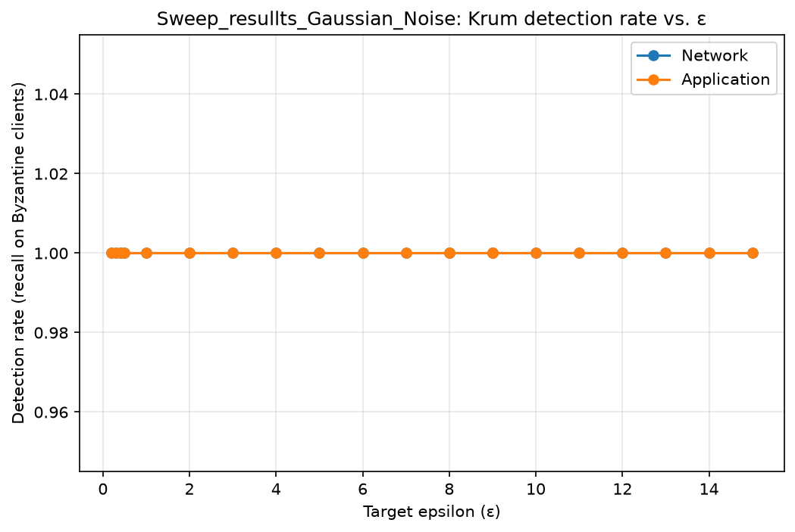
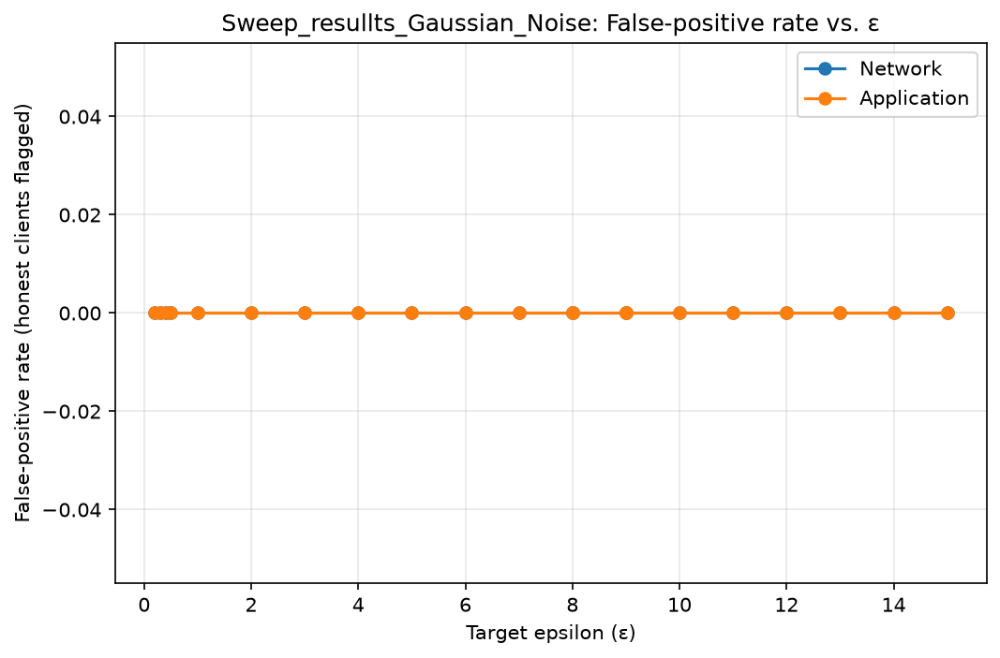
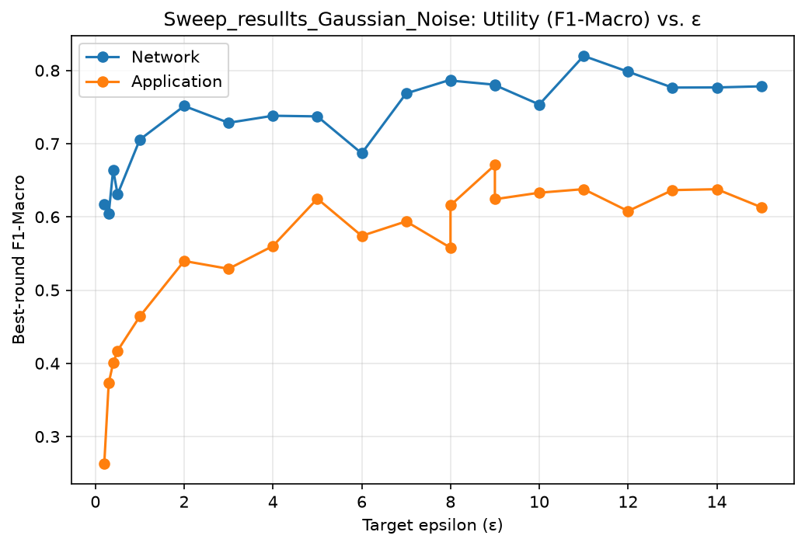
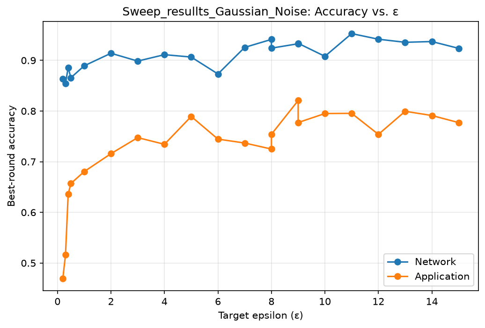
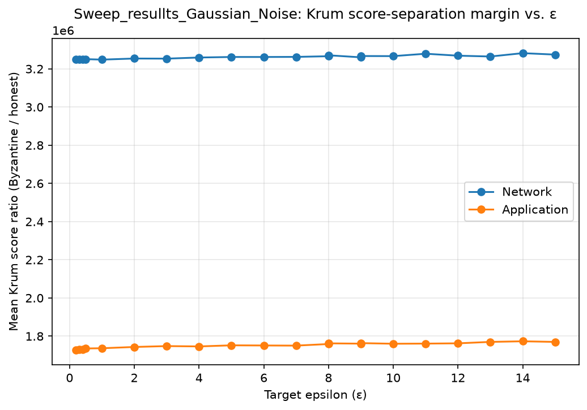
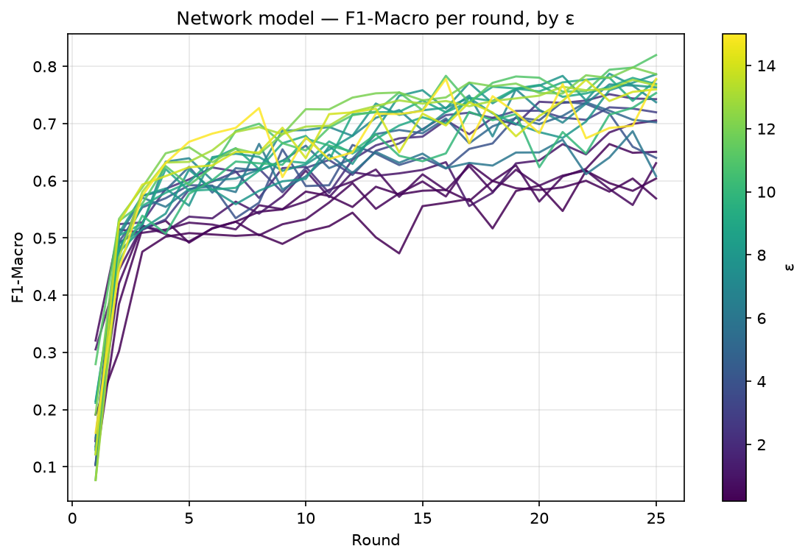
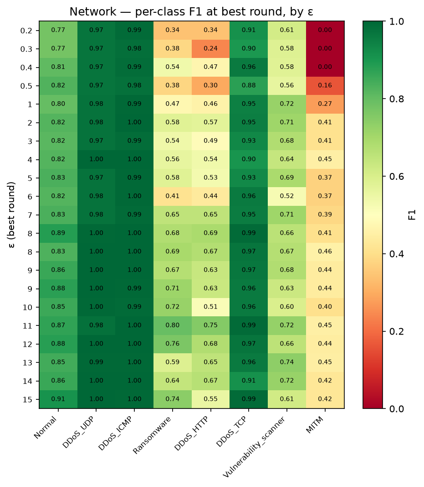
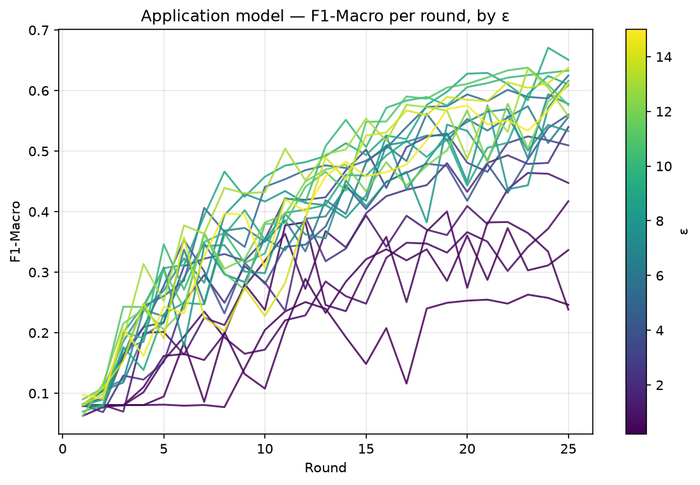
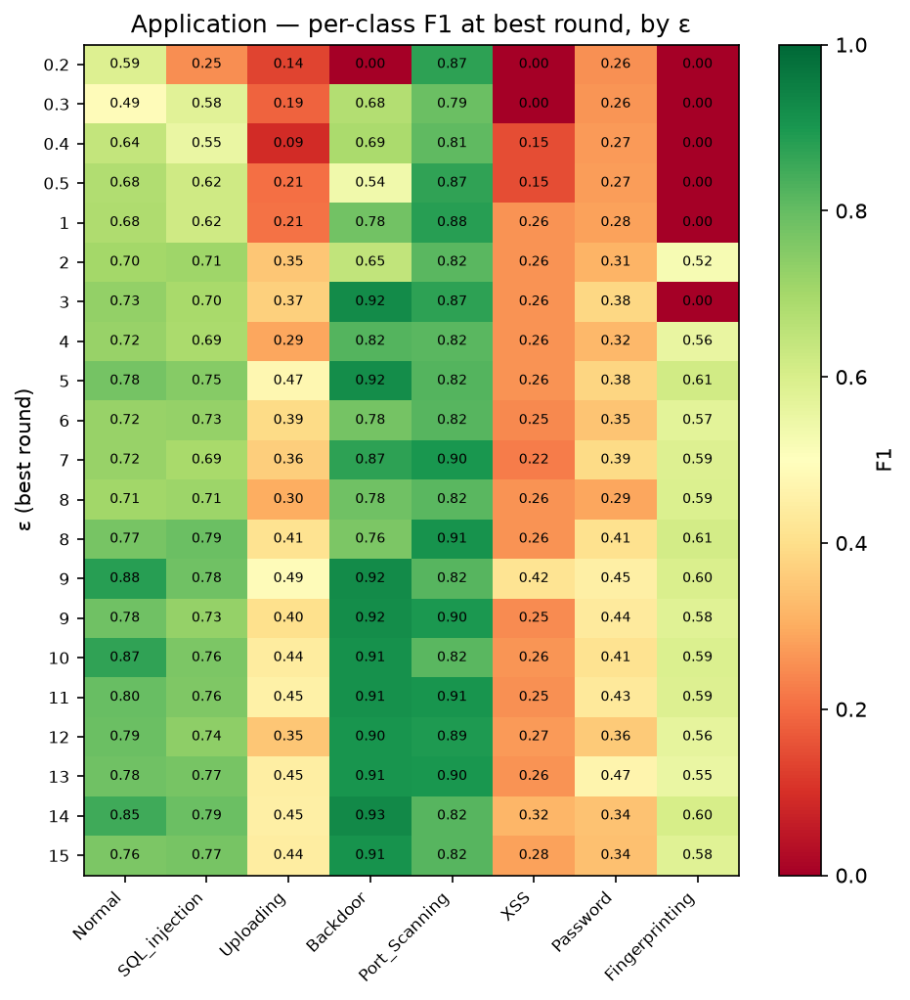

# Sweep_resullts_Gaussian_Noise — Automated Results Analysis

**Source folder:** `C:\Users\Zarawar Khan\09-edge-iot-security-monitoring\RESULTS AND MANIFESTS\Experiment 1\Sweep_resullts_Gaussian_Noise`  
**Files parsed:** 42 result CSV(s), 48 manifest JSON(s)  

This report was generated automatically. Every number in it was computed directly from the committed CSV files in the source folder above — nothing here is estimated, rounded from memory, or carried over from a prior write-up. Where something could not be computed (a missing column, an unparseable filename), it is stated explicitly rather than silently omitted.

---

## 1. Data Inventory

- **Application model:** 19 unique epsilon point(s) found across **21 files** (more files than unique epsilon values — see duplicate-file table below): 0.2, 0.3, 0.4, 0.5, 1, 2, 3, 4, 5, 6, 7, 8, 9, 10, 11, 12, 13, 14, 15
- **Network model:** 19 unique epsilon point(s) found across **21 files** (more files than unique epsilon values — see duplicate-file table below): 0.2, 0.3, 0.4, 0.5, 1, 2, 3, 4, 5, 6, 7, 8, 9, 10, 11, 12, 13, 14, 15

**4 (model, ε) pair(s) are backed by more than one file** — every metric elsewhere in this report for these points uses whichever file pandas encountered last while scanning the folder, silently discarding the other(s). This is not necessarily an error — it may be genuine repeat-seed data — but it should be resolved explicitly (averaged, or one file deliberately chosen) rather than left to file-scan order:

| Model | ε | # files | Source files | Best F1-Macro per file | Mean round time per file (s) |
|---|---|---|---|---|---|
| application | 8 | 2 | `results_application_gaussian_dp08.csv`, `results_application_gaussian_dp8.csv` | 0.5578, 0.6158 | 691.4, 682.7 |
| application | 9 | 2 | `results_application_gaussian_dp09.csv`, `results_application_gaussian_dp9.csv` | 0.6708, 0.6241 | 692.9, 559.5 |
| network | 8 | 2 | `results_network_gaussian_dp08.csv`, `results_network_gaussian_dp8.csv` | 0.7873, 0.7861 | 636.0, 567.4 |
| network | 9 | 2 | `results_network_gaussian_dp09.csv`, `results_network_gaussian_dp9.csv` | 0.7805, 0.7800 | 663.8, 426.5 |

## 2. Krum Detection Performance vs. Epsilon

Ground-truth Byzantine clients assumed: 0-indexed `[0, 1]` (edit `BYZANTINE_CLIENTS_0INDEXED` at the top of the script if this is wrong for your sweep — check each manifest's `byzantine_clients` field in §6 to confirm).

| ε | Model | Detection rate | False-positive rate |
|---|---|---|---|
| 0.2 | application | 100.00% | 0.00% |
| 0.3 | application | 100.00% | 0.00% |
| 0.4 | application | 100.00% | 0.00% |
| 0.5 | application | 100.00% | 0.00% |
| 1 | application | 100.00% | 0.00% |
| 2 | application | 100.00% | 0.00% |
| 3 | application | 100.00% | 0.00% |
| 4 | application | 100.00% | 0.00% |
| 5 | application | 100.00% | 0.00% |
| 6 | application | 100.00% | 0.00% |
| 7 | application | 100.00% | 0.00% |
| 8 | application | 100.00% | 0.00% |
| 8 | application | 100.00% | 0.00% |
| 9 | application | 100.00% | 0.00% |
| 9 | application | 100.00% | 0.00% |
| 10 | application | 100.00% | 0.00% |
| 11 | application | 100.00% | 0.00% |
| 12 | application | 100.00% | 0.00% |
| 13 | application | 100.00% | 0.00% |
| 14 | application | 100.00% | 0.00% |
| 15 | application | 100.00% | 0.00% |
| 0.2 | network | 100.00% | 0.00% |
| 0.3 | network | 100.00% | 0.00% |
| 0.4 | network | 100.00% | 0.00% |
| 0.5 | network | 100.00% | 0.00% |
| 1 | network | 100.00% | 0.00% |
| 2 | network | 100.00% | 0.00% |
| 3 | network | 100.00% | 0.00% |
| 4 | network | 100.00% | 0.00% |
| 5 | network | 100.00% | 0.00% |
| 6 | network | 100.00% | 0.00% |
| 7 | network | 100.00% | 0.00% |
| 8 | network | 100.00% | 0.00% |
| 8 | network | 100.00% | 0.00% |
| 9 | network | 100.00% | 0.00% |
| 9 | network | 100.00% | 0.00% |
| 10 | network | 100.00% | 0.00% |
| 11 | network | 100.00% | 0.00% |
| 12 | network | 100.00% | 0.00% |
| 13 | network | 100.00% | 0.00% |
| 14 | network | 100.00% | 0.00% |
| 15 | network | 100.00% | 0.00% |





Detection rate was effectively 100% at every tested epsilon, for both models, in this sweep.

## 3. Utility vs. Epsilon

| ε | Model | Best round | Best F1-Macro | Best Accuracy | Mean round time (s) |
|---|---|---|---|---|---|
| 0.2 | application | 23 | 0.2630 | 0.4694 | 685.5 |
| 0.3 | application | 22 | 0.3729 | 0.5162 | 687.3 |
| 0.4 | application | 19 | 0.4003 | 0.6358 | 618.0 |
| 0.5 | application | 25 | 0.4173 | 0.6570 | 160.8 |
| 1 | application | 23 | 0.4640 | 0.6805 | 161.0 |
| 2 | application | 25 | 0.5398 | 0.7159 | 161.6 |
| 3 | application | 19 | 0.5291 | 0.7476 | 230.1 |
| 4 | application | 25 | 0.5602 | 0.7343 | 262.4 |
| 5 | application | 25 | 0.6248 | 0.7893 | 260.8 |
| 6 | application | 23 | 0.5741 | 0.7446 | 342.9 |
| 7 | application | 24 | 0.5938 | 0.7369 | 571.5 |
| 8 | application | 22 | 0.5578 | 0.7249 | 691.4 |
| 8 | application | 25 | 0.6158 | 0.7542 | 682.7 |
| 9 | application | 24 | 0.6708 | 0.8208 | 692.9 |
| 9 | application | 24 | 0.6241 | 0.7773 | 559.5 |
| 10 | application | 25 | 0.6330 | 0.7951 | 684.1 |
| 11 | application | 23 | 0.6379 | 0.7954 | 557.1 |
| 12 | application | 25 | 0.6079 | 0.7539 | 620.9 |
| 13 | application | 23 | 0.6366 | 0.7995 | 449.5 |
| 14 | application | 25 | 0.6378 | 0.7912 | 355.2 |
| 15 | application | 25 | 0.6132 | 0.7772 | 354.9 |
| 0.2 | network | 22 | 0.6175 | 0.8636 | 658.6 |
| 0.3 | network | 24 | 0.6040 | 0.8545 | 663.9 |
| 0.4 | network | 23 | 0.6643 | 0.8857 | 661.6 |
| 0.5 | network | 25 | 0.6309 | 0.8658 | 316.8 |
| 1 | network | 25 | 0.7055 | 0.8893 | 315.8 |
| 2 | network | 23 | 0.7514 | 0.9141 | 376.7 |
| 3 | network | 23 | 0.7285 | 0.8986 | 680.0 |
| 4 | network | 21 | 0.7381 | 0.9113 | 770.8 |
| 5 | network | 22 | 0.7372 | 0.9066 | 710.4 |
| 6 | network | 24 | 0.6868 | 0.8732 | 731.2 |
| 7 | network | 23 | 0.7686 | 0.9256 | 702.7 |
| 8 | network | 23 | 0.7873 | 0.9414 | 636.0 |
| 8 | network | 25 | 0.7861 | 0.9242 | 567.4 |
| 9 | network | 23 | 0.7805 | 0.9328 | 663.8 |
| 9 | network | 24 | 0.7800 | 0.9337 | 426.5 |
| 10 | network | 25 | 0.7535 | 0.9080 | 649.4 |
| 11 | network | 25 | 0.8198 | 0.9529 | 727.5 |
| 12 | network | 24 | 0.7982 | 0.9418 | 428.8 |
| 13 | network | 24 | 0.7766 | 0.9357 | 427.3 |
| 14 | network | 22 | 0.7768 | 0.9372 | 288.3 |
| 15 | network | 25 | 0.7783 | 0.9238 | 263.0 |





- **Application model — empirically best ε in this sweep:** ε=9 (F1-Macro=0.6708 at round 24). **Single-seed result — do not cite as a confirmed optimum without a repeat run (see §8).**
- **Network model — empirically best ε in this sweep:** ε=11 (F1-Macro=0.8198 at round 25). **Single-seed result — do not cite as a confirmed optimum without a repeat run (see §8).**

## 4. Krum Score-Separation Margin vs. Epsilon

`krum_score_ratio` = mean Byzantine Krum score / mean honest Krum score. A ratio near 1.0 means Krum cannot separate attackers from honest clients on a score basis (even if the MAD threshold still happens to catch them); a large ratio means a wide, robust separation margin.

| ε | Model | Mean Krum score ratio |
|---|---|---|
| 0.2 | application | 1727273.6111 |
| 0.3 | application | 1729466.0808 |
| 0.4 | application | 1730496.5382 |
| 0.5 | application | 1735572.4964 |
| 1 | application | 1736772.7101 |
| 2 | application | 1743443.7313 |
| 3 | application | 1748039.7155 |
| 4 | application | 1746276.3411 |
| 5 | application | 1752017.3877 |
| 6 | application | 1751237.4321 |
| 7 | application | 1750504.2419 |
| 8 | application | 1758836.3593 |
| 8 | application | 1762396.6784 |
| 9 | application | 1760848.8574 |
| 9 | application | 1763576.4324 |
| 10 | application | 1760348.1292 |
| 11 | application | 1761075.6166 |
| 12 | application | 1762494.7016 |
| 13 | application | 1769997.4466 |
| 14 | application | 1773182.9925 |
| 15 | application | 1769959.2997 |
| 0.2 | network | 3250626.1885 |
| 0.3 | network | 3250127.1726 |
| 0.4 | network | 3248294.8876 |
| 0.5 | network | 3250883.5741 |
| 1 | network | 3248264.1962 |
| 2 | network | 3254051.7432 |
| 3 | network | 3253474.0607 |
| 4 | network | 3259345.4000 |
| 5 | network | 3262134.8990 |
| 6 | network | 3262103.5605 |
| 7 | network | 3262623.7420 |
| 8 | network | 3266093.0768 |
| 8 | network | 3271019.2618 |
| 9 | network | 3260350.6748 |
| 9 | network | 3267138.9734 |
| 10 | network | 3266608.4121 |
| 11 | network | 3279147.8178 |
| 12 | network | 3268936.2765 |
| 13 | network | 3264625.7328 |
| 14 | network | 3282155.7016 |
| 15 | network | 3274648.7733 |



## 5. Per-Round Trajectories & Per-Class Breakdown

### Network model





### Application model





## 6. Manifest-Derived Context

### `experiment_config_application_gaussian_dp0.5.json`

(No fields matched this script's known manifest schema — raw content preserved below for manual review.)

```json
{
  "ablation_mode": "krum_dp_sweep",
  "model_type": "application",
  "sanity_check": false,
  "num_rounds": 25,
  "num_clients": 10,
  "num_features_measured": 90,
  "local_epochs": 5,
  "learning_rate": 0.001,
  "prox_mu": 0.02,
  "byzantine_attack": true,
  "num_byzantine": 2,
  "byzantine_clients": [
    0,
    1
  ],
  "attack_scale": 2.0,
  "attack_type": "gaussian",
  "gaussian_std": 30.0,
  "attack_function": "gaussian_attack_trained",
  "use_krum": false,
  "krum_m": 7,
  "krum_discards": 3,
  "use_adaptive_krum": true,
  "adaptive_krum_k": 2.5,
  "adaptive_krum_hybrid_assumed_f": 1,
  "byzantine_clients_cli_override": null,
  "adaptive_krum_method": "mad",
  "adaptive_krum_min_keep_fraction": 0.5,
  "use_he": false,
  "use_he_krum_hybrid": false,
  "use_zkp": false,
  "use_head_norm_guard": true,
  "head_norm_guard_k": 2.5,
  "head_norm_guard_min_keep_fraction": 0.5,
  "he_poly_degree": null,
  "use_dp": true,
  "dp_epsilon": 0.5,
  "dp_delta": 1e-05,
  "dp_max_grad_norm": 1.5,
  "dp_batch_size": 512,
  "dp_accountant": "rdp",
  "byzantine_head_only": false,
  "dp_safe": true,
  "device": "cuda",
  "cuda_available": true,
  "client_pool_workers": 1,
  "threads_per_worker": 20,
  "framework": "custom Python simulation (direct, parallel client training)"
}
```

### `experiment_config_application_gaussian_dp08.json`

(No fields matched this script's known manifest schema — raw content preserved below for manual review.)

```json
{
  "ablation_mode": "krum_dp_sweep",
  "model_type": "application",
  "sanity_check": false,
  "num_rounds": 25,
  "num_clients": 10,
  "num_features_measured": 90,
  "local_epochs": 5,
  "learning_rate": 0.001,
  "prox_mu": 0.02,
  "byzantine_attack": true,
  "num_byzantine": 2,
  "byzantine_clients": [
    0,
    1
  ],
  "attack_scale": 2.0,
  "attack_type": "gaussian",
  "gaussian_std": 30.0,
  "attack_function": "gaussian_attack_trained",
  "use_krum": false,
  "krum_m": 7,
  "krum_discards": 3,
  "use_adaptive_krum": true,
  "adaptive_krum_k": 2.5,
  "adaptive_krum_hybrid_assumed_f": 1,
  "byzantine_clients_cli_override": null,
  "adaptive_krum_method": "mad",
  "adaptive_krum_min_keep_fraction": 0.5,
  "use_he": false,
  "use_he_krum_hybrid": false,
  "use_zkp": false,
  "use_head_norm_guard": true,
  "head_norm_guard_k": 2.5,
  "head_norm_guard_min_keep_fraction": 0.5,
  "he_poly_degree": null,
  "use_dp": true,
  "dp_epsilon": 8.0,
  "dp_delta": 1e-05,
  "dp_max_grad_norm": 1.5,
  "dp_batch_size": 512,
  "dp_accountant": "rdp",
  "byzantine_head_only": false,
  "dp_safe": true,
  "device": "cuda",
  "cuda_available": true,
  "client_pool_workers": 1,
  "threads_per_worker": 20,
  "framework": "custom Python simulation (direct, parallel client training)"
}
```

### `experiment_config_application_gaussian_dp09.json`

(No fields matched this script's known manifest schema — raw content preserved below for manual review.)

```json
{
  "ablation_mode": "krum_dp_sweep",
  "model_type": "application",
  "sanity_check": false,
  "num_rounds": 25,
  "num_clients": 10,
  "num_features_measured": 90,
  "local_epochs": 5,
  "learning_rate": 0.001,
  "prox_mu": 0.02,
  "byzantine_attack": true,
  "num_byzantine": 2,
  "byzantine_clients": [
    0,
    1
  ],
  "attack_scale": 2.0,
  "attack_type": "gaussian",
  "gaussian_std": 30.0,
  "attack_function": "gaussian_attack_trained",
  "use_krum": false,
  "krum_m": 7,
  "krum_discards": 3,
  "use_adaptive_krum": true,
  "adaptive_krum_k": 2.5,
  "adaptive_krum_hybrid_assumed_f": 1,
  "byzantine_clients_cli_override": null,
  "adaptive_krum_method": "mad",
  "adaptive_krum_min_keep_fraction": 0.5,
  "use_he": false,
  "use_he_krum_hybrid": false,
  "use_zkp": false,
  "use_head_norm_guard": true,
  "head_norm_guard_k": 2.5,
  "head_norm_guard_min_keep_fraction": 0.5,
  "he_poly_degree": null,
  "use_dp": true,
  "dp_epsilon": 9.0,
  "dp_delta": 1e-05,
  "dp_max_grad_norm": 1.5,
  "dp_batch_size": 512,
  "dp_accountant": "rdp",
  "byzantine_head_only": false,
  "dp_safe": true,
  "device": "cuda",
  "cuda_available": true,
  "client_pool_workers": 1,
  "threads_per_worker": 20,
  "framework": "custom Python simulation (direct, parallel client training)"
}
```

### `experiment_config_application_gaussian_dp0p05.json`

(No fields matched this script's known manifest schema — raw content preserved below for manual review.)

```json
{
  "ablation_mode": "krum_dp_sweep",
  "model_type": "application",
  "sanity_check": false,
  "num_rounds": 25,
  "num_clients": 10,
  "num_features_measured": 90,
  "local_epochs": 5,
  "learning_rate": 0.001,
  "prox_mu": 0.02,
  "byzantine_attack": true,
  "num_byzantine": 2,
  "byzantine_clients": [
    0,
    1
  ],
  "attack_scale": 2.0,
  "attack_type": "gaussian",
  "gaussian_std": 30.0,
  "attack_function": "gaussian_attack_trained",
  "use_krum": false,
  "krum_m": 7,
  "krum_discards": 3,
  "use_adaptive_krum": true,
  "adaptive_krum_k": 2.5,
  "adaptive_krum_hybrid_assumed_f": 1,
  "byzantine_clients_cli_override": null,
  "adaptive_krum_method": "mad",
  "adaptive_krum_min_keep_fraction": 0.5,
  "use_he": false,
  "use_he_krum_hybrid": false,
  "use_zkp": false,
  "use_head_norm_guard": true,
  "head_norm_guard_k": 2.5,
  "head_norm_guard_min_keep_fraction": 0.5,
  "he_poly_degree": null,
  "use_dp": true,
  "dp_epsilon": 0.05,
  "dp_delta": 1e-05,
  "dp_max_grad_norm": 1.5,
  "dp_batch_size": 512,
  "dp_accountant": "rdp",
  "byzantine_head_only": false,
  "dp_safe": true,
  "device": "cuda",
  "cuda_available": true,
  "client_pool_workers": 1,
  "threads_per_worker": 20,
  "framework": "custom Python simulation (direct, parallel client training)"
}
```

### `experiment_config_application_gaussian_dp0p075.json`

(No fields matched this script's known manifest schema — raw content preserved below for manual review.)

```json
{
  "ablation_mode": "krum_dp_sweep",
  "model_type": "application",
  "sanity_check": false,
  "num_rounds": 25,
  "num_clients": 10,
  "num_features_measured": 90,
  "local_epochs": 5,
  "learning_rate": 0.001,
  "prox_mu": 0.02,
  "byzantine_attack": true,
  "num_byzantine": 2,
  "byzantine_clients": [
    0,
    1
  ],
  "attack_scale": 2.0,
  "attack_type": "gaussian",
  "gaussian_std": 30.0,
  "attack_function": "gaussian_attack_trained",
  "use_krum": false,
  "krum_m": 7,
  "krum_discards": 3,
  "use_adaptive_krum": true,
  "adaptive_krum_k": 2.5,
  "adaptive_krum_hybrid_assumed_f": 1,
  "byzantine_clients_cli_override": null,
  "adaptive_krum_method": "mad",
  "adaptive_krum_min_keep_fraction": 0.5,
  "use_he": false,
  "use_he_krum_hybrid": false,
  "use_zkp": false,
  "use_head_norm_guard": true,
  "head_norm_guard_k": 2.5,
  "head_norm_guard_min_keep_fraction": 0.5,
  "he_poly_degree": null,
  "use_dp": true,
  "dp_epsilon": 0.075,
  "dp_delta": 1e-05,
  "dp_max_grad_norm": 1.5,
  "dp_batch_size": 512,
  "dp_accountant": "rdp",
  "byzantine_head_only": false,
  "dp_safe": true,
  "device": "cuda",
  "cuda_available": true,
  "client_pool_workers": 1,
  "threads_per_worker": 20,
  "framework": "custom Python simulation (direct, parallel client training)"
}
```

### `experiment_config_application_gaussian_dp0p1.json`

(No fields matched this script's known manifest schema — raw content preserved below for manual review.)

```json
{
  "ablation_mode": "krum_dp_sweep",
  "model_type": "application",
  "sanity_check": false,
  "num_rounds": 25,
  "num_clients": 10,
  "num_features_measured": 90,
  "local_epochs": 5,
  "learning_rate": 0.001,
  "prox_mu": 0.02,
  "byzantine_attack": true,
  "num_byzantine": 2,
  "byzantine_clients": [
    0,
    1
  ],
  "attack_scale": 2.0,
  "attack_type": "gaussian",
  "gaussian_std": 30.0,
  "attack_function": "gaussian_attack_trained",
  "use_krum": false,
  "krum_m": 7,
  "krum_discards": 3,
  "use_adaptive_krum": true,
  "adaptive_krum_k": 2.5,
  "adaptive_krum_hybrid_assumed_f": 1,
  "byzantine_clients_cli_override": null,
  "adaptive_krum_method": "mad",
  "adaptive_krum_min_keep_fraction": 0.5,
  "use_he": false,
  "use_he_krum_hybrid": false,
  "use_zkp": false,
  "use_head_norm_guard": true,
  "head_norm_guard_k": 2.5,
  "head_norm_guard_min_keep_fraction": 0.5,
  "he_poly_degree": null,
  "use_dp": true,
  "dp_epsilon": 0.1,
  "dp_delta": 1e-05,
  "dp_max_grad_norm": 1.5,
  "dp_batch_size": 512,
  "dp_accountant": "rdp",
  "byzantine_head_only": false,
  "dp_safe": true,
  "device": "cuda",
  "cuda_available": true,
  "client_pool_workers": 1,
  "threads_per_worker": 20,
  "framework": "custom Python simulation (direct, parallel client training)"
}
```

### `experiment_config_application_gaussian_dp0p2.json`

(No fields matched this script's known manifest schema — raw content preserved below for manual review.)

```json
{
  "ablation_mode": "krum_dp_sweep",
  "model_type": "application",
  "sanity_check": false,
  "num_rounds": 25,
  "num_clients": 10,
  "num_features_measured": 90,
  "local_epochs": 5,
  "learning_rate": 0.001,
  "prox_mu": 0.02,
  "byzantine_attack": true,
  "num_byzantine": 2,
  "byzantine_clients": [
    0,
    1
  ],
  "attack_scale": 2.0,
  "attack_type": "gaussian",
  "gaussian_std": 30.0,
  "attack_function": "gaussian_attack_trained",
  "use_krum": false,
  "krum_m": 7,
  "krum_discards": 3,
  "use_adaptive_krum": true,
  "adaptive_krum_k": 2.5,
  "adaptive_krum_hybrid_assumed_f": 1,
  "byzantine_clients_cli_override": null,
  "adaptive_krum_method": "mad",
  "adaptive_krum_min_keep_fraction": 0.5,
  "use_he": false,
  "use_he_krum_hybrid": false,
  "use_zkp": false,
  "use_head_norm_guard": true,
  "head_norm_guard_k": 2.5,
  "head_norm_guard_min_keep_fraction": 0.5,
  "he_poly_degree": null,
  "use_dp": true,
  "dp_epsilon": 0.2,
  "dp_delta": 1e-05,
  "dp_max_grad_norm": 1.5,
  "dp_batch_size": 512,
  "dp_accountant": "rdp",
  "byzantine_head_only": false,
  "dp_safe": true,
  "device": "cuda",
  "cuda_available": true,
  "client_pool_workers": 1,
  "threads_per_worker": 20,
  "framework": "custom Python simulation (direct, parallel client training)"
}
```

### `experiment_config_application_gaussian_dp0p3.json`

(No fields matched this script's known manifest schema — raw content preserved below for manual review.)

```json
{
  "ablation_mode": "krum_dp_sweep",
  "model_type": "application",
  "sanity_check": false,
  "num_rounds": 25,
  "num_clients": 10,
  "num_features_measured": 90,
  "local_epochs": 5,
  "learning_rate": 0.001,
  "prox_mu": 0.02,
  "byzantine_attack": true,
  "num_byzantine": 2,
  "byzantine_clients": [
    0,
    1
  ],
  "attack_scale": 2.0,
  "attack_type": "gaussian",
  "gaussian_std": 30.0,
  "attack_function": "gaussian_attack_trained",
  "use_krum": false,
  "krum_m": 7,
  "krum_discards": 3,
  "use_adaptive_krum": true,
  "adaptive_krum_k": 2.5,
  "adaptive_krum_hybrid_assumed_f": 1,
  "byzantine_clients_cli_override": null,
  "adaptive_krum_method": "mad",
  "adaptive_krum_min_keep_fraction": 0.5,
  "use_he": false,
  "use_he_krum_hybrid": false,
  "use_zkp": false,
  "use_head_norm_guard": true,
  "head_norm_guard_k": 2.5,
  "head_norm_guard_min_keep_fraction": 0.5,
  "he_poly_degree": null,
  "use_dp": true,
  "dp_epsilon": 0.3,
  "dp_delta": 1e-05,
  "dp_max_grad_norm": 1.5,
  "dp_batch_size": 512,
  "dp_accountant": "rdp",
  "byzantine_head_only": false,
  "dp_safe": true,
  "device": "cuda",
  "cuda_available": true,
  "client_pool_workers": 1,
  "threads_per_worker": 20,
  "framework": "custom Python simulation (direct, parallel client training)"
}
```

### `experiment_config_application_gaussian_dp0p4.json`

(No fields matched this script's known manifest schema — raw content preserved below for manual review.)

```json
{
  "ablation_mode": "krum_dp_sweep",
  "model_type": "application",
  "sanity_check": false,
  "num_rounds": 25,
  "num_clients": 10,
  "num_features_measured": 90,
  "local_epochs": 5,
  "learning_rate": 0.001,
  "prox_mu": 0.02,
  "byzantine_attack": true,
  "num_byzantine": 2,
  "byzantine_clients": [
    0,
    1
  ],
  "attack_scale": 2.0,
  "attack_type": "gaussian",
  "gaussian_std": 30.0,
  "attack_function": "gaussian_attack_trained",
  "use_krum": false,
  "krum_m": 7,
  "krum_discards": 3,
  "use_adaptive_krum": true,
  "adaptive_krum_k": 2.5,
  "adaptive_krum_hybrid_assumed_f": 1,
  "byzantine_clients_cli_override": null,
  "adaptive_krum_method": "mad",
  "adaptive_krum_min_keep_fraction": 0.5,
  "use_he": false,
  "use_he_krum_hybrid": false,
  "use_zkp": false,
  "use_head_norm_guard": true,
  "head_norm_guard_k": 2.5,
  "head_norm_guard_min_keep_fraction": 0.5,
  "he_poly_degree": null,
  "use_dp": true,
  "dp_epsilon": 0.4,
  "dp_delta": 1e-05,
  "dp_max_grad_norm": 1.5,
  "dp_batch_size": 512,
  "dp_accountant": "rdp",
  "byzantine_head_only": false,
  "dp_safe": true,
  "device": "cuda",
  "cuda_available": true,
  "client_pool_workers": 1,
  "threads_per_worker": 20,
  "framework": "custom Python simulation (direct, parallel client training)"
}
```

### `experiment_config_application_gaussian_dp1.json`

(No fields matched this script's known manifest schema — raw content preserved below for manual review.)

```json
{
  "ablation_mode": "krum_dp_sweep",
  "model_type": "application",
  "sanity_check": false,
  "num_rounds": 25,
  "num_clients": 10,
  "num_features_measured": 90,
  "local_epochs": 5,
  "learning_rate": 0.001,
  "prox_mu": 0.02,
  "byzantine_attack": true,
  "num_byzantine": 2,
  "byzantine_clients": [
    0,
    1
  ],
  "attack_scale": 2.0,
  "attack_type": "gaussian",
  "gaussian_std": 30.0,
  "attack_function": "gaussian_attack_trained",
  "use_krum": false,
  "krum_m": 7,
  "krum_discards": 3,
  "use_adaptive_krum": true,
  "adaptive_krum_k": 2.5,
  "adaptive_krum_hybrid_assumed_f": 1,
  "byzantine_clients_cli_override": null,
  "adaptive_krum_method": "mad",
  "adaptive_krum_min_keep_fraction": 0.5,
  "use_he": false,
  "use_he_krum_hybrid": false,
  "use_zkp": false,
  "use_head_norm_guard": true,
  "head_norm_guard_k": 2.5,
  "head_norm_guard_min_keep_fraction": 0.5,
  "he_poly_degree": null,
  "use_dp": true,
  "dp_epsilon": 1.0,
  "dp_delta": 1e-05,
  "dp_max_grad_norm": 1.5,
  "dp_batch_size": 512,
  "dp_accountant": "rdp",
  "byzantine_head_only": false,
  "dp_safe": true,
  "device": "cuda",
  "cuda_available": true,
  "client_pool_workers": 1,
  "threads_per_worker": 20,
  "framework": "custom Python simulation (direct, parallel client training)"
}
```

### `experiment_config_application_gaussian_dp10.json`

(No fields matched this script's known manifest schema — raw content preserved below for manual review.)

```json
{
  "ablation_mode": "krum_dp_sweep",
  "model_type": "application",
  "sanity_check": false,
  "num_rounds": 25,
  "num_clients": 10,
  "num_features_measured": 90,
  "local_epochs": 5,
  "learning_rate": 0.001,
  "prox_mu": 0.02,
  "byzantine_attack": true,
  "num_byzantine": 2,
  "byzantine_clients": [
    0,
    1
  ],
  "attack_scale": 2.0,
  "attack_type": "gaussian",
  "gaussian_std": 30.0,
  "attack_function": "gaussian_attack_trained",
  "use_krum": false,
  "krum_m": 7,
  "krum_discards": 3,
  "use_adaptive_krum": true,
  "adaptive_krum_k": 2.5,
  "adaptive_krum_hybrid_assumed_f": 1,
  "byzantine_clients_cli_override": null,
  "adaptive_krum_method": "mad",
  "adaptive_krum_min_keep_fraction": 0.5,
  "use_he": false,
  "use_he_krum_hybrid": false,
  "use_zkp": false,
  "use_head_norm_guard": true,
  "head_norm_guard_k": 2.5,
  "head_norm_guard_min_keep_fraction": 0.5,
  "he_poly_degree": null,
  "use_dp": true,
  "dp_epsilon": 10.0,
  "dp_delta": 1e-05,
  "dp_max_grad_norm": 1.5,
  "dp_batch_size": 512,
  "dp_accountant": "rdp",
  "byzantine_head_only": false,
  "dp_safe": true,
  "device": "cuda",
  "cuda_available": true,
  "client_pool_workers": 1,
  "threads_per_worker": 20,
  "framework": "custom Python simulation (direct, parallel client training)"
}
```

### `experiment_config_application_gaussian_dp11.json`

(No fields matched this script's known manifest schema — raw content preserved below for manual review.)

```json
{
  "ablation_mode": "krum_dp_sweep",
  "model_type": "application",
  "sanity_check": false,
  "num_rounds": 25,
  "num_clients": 10,
  "num_features_measured": 90,
  "local_epochs": 5,
  "learning_rate": 0.001,
  "prox_mu": 0.02,
  "byzantine_attack": true,
  "num_byzantine": 2,
  "byzantine_clients": [
    0,
    1
  ],
  "attack_scale": 2.0,
  "attack_type": "gaussian",
  "gaussian_std": 30.0,
  "attack_function": "gaussian_attack_trained",
  "use_krum": false,
  "krum_m": 7,
  "krum_discards": 3,
  "use_adaptive_krum": true,
  "adaptive_krum_k": 2.5,
  "adaptive_krum_hybrid_assumed_f": 1,
  "byzantine_clients_cli_override": null,
  "adaptive_krum_method": "mad",
  "adaptive_krum_min_keep_fraction": 0.5,
  "use_he": false,
  "use_he_krum_hybrid": false,
  "use_zkp": false,
  "use_head_norm_guard": true,
  "head_norm_guard_k": 2.5,
  "head_norm_guard_min_keep_fraction": 0.5,
  "he_poly_degree": null,
  "use_dp": true,
  "dp_epsilon": 11.0,
  "dp_delta": 1e-05,
  "dp_max_grad_norm": 1.5,
  "dp_batch_size": 512,
  "dp_accountant": "rdp",
  "byzantine_head_only": false,
  "dp_safe": true,
  "device": "cuda",
  "cuda_available": true,
  "client_pool_workers": 1,
  "threads_per_worker": 20,
  "framework": "custom Python simulation (direct, parallel client training)"
}
```

### `experiment_config_application_gaussian_dp12.json`

(No fields matched this script's known manifest schema — raw content preserved below for manual review.)

```json
{
  "ablation_mode": "krum_dp_sweep",
  "model_type": "application",
  "sanity_check": false,
  "num_rounds": 25,
  "num_clients": 10,
  "num_features_measured": 90,
  "local_epochs": 5,
  "learning_rate": 0.001,
  "prox_mu": 0.02,
  "byzantine_attack": true,
  "num_byzantine": 2,
  "byzantine_clients": [
    0,
    1
  ],
  "attack_scale": 2.0,
  "attack_type": "gaussian",
  "gaussian_std": 30.0,
  "attack_function": "gaussian_attack_trained",
  "use_krum": false,
  "krum_m": 7,
  "krum_discards": 3,
  "use_adaptive_krum": true,
  "adaptive_krum_k": 2.5,
  "adaptive_krum_hybrid_assumed_f": 1,
  "byzantine_clients_cli_override": null,
  "adaptive_krum_method": "mad",
  "adaptive_krum_min_keep_fraction": 0.5,
  "use_he": false,
  "use_he_krum_hybrid": false,
  "use_zkp": false,
  "use_head_norm_guard": true,
  "head_norm_guard_k": 2.5,
  "head_norm_guard_min_keep_fraction": 0.5,
  "he_poly_degree": null,
  "use_dp": true,
  "dp_epsilon": 12.0,
  "dp_delta": 1e-05,
  "dp_max_grad_norm": 1.5,
  "dp_batch_size": 512,
  "dp_accountant": "rdp",
  "byzantine_head_only": false,
  "dp_safe": true,
  "device": "cuda",
  "cuda_available": true,
  "client_pool_workers": 1,
  "threads_per_worker": 20,
  "framework": "custom Python simulation (direct, parallel client training)"
}
```

### `experiment_config_application_gaussian_dp13.json`

(No fields matched this script's known manifest schema — raw content preserved below for manual review.)

```json
{
  "ablation_mode": "krum_dp_sweep",
  "model_type": "application",
  "sanity_check": false,
  "num_rounds": 25,
  "num_clients": 10,
  "num_features_measured": 90,
  "local_epochs": 5,
  "learning_rate": 0.001,
  "prox_mu": 0.02,
  "byzantine_attack": true,
  "num_byzantine": 2,
  "byzantine_clients": [
    0,
    1
  ],
  "attack_scale": 2.0,
  "attack_type": "gaussian",
  "gaussian_std": 30.0,
  "attack_function": "gaussian_attack_trained",
  "use_krum": false,
  "krum_m": 7,
  "krum_discards": 3,
  "use_adaptive_krum": true,
  "adaptive_krum_k": 2.5,
  "adaptive_krum_hybrid_assumed_f": 1,
  "byzantine_clients_cli_override": null,
  "adaptive_krum_method": "mad",
  "adaptive_krum_min_keep_fraction": 0.5,
  "use_he": false,
  "use_he_krum_hybrid": false,
  "use_zkp": false,
  "use_head_norm_guard": true,
  "head_norm_guard_k": 2.5,
  "head_norm_guard_min_keep_fraction": 0.5,
  "he_poly_degree": null,
  "use_dp": true,
  "dp_epsilon": 13.0,
  "dp_delta": 1e-05,
  "dp_max_grad_norm": 1.5,
  "dp_batch_size": 512,
  "dp_accountant": "rdp",
  "byzantine_head_only": false,
  "dp_safe": true,
  "device": "cuda",
  "cuda_available": true,
  "client_pool_workers": 1,
  "threads_per_worker": 20,
  "framework": "custom Python simulation (direct, parallel client training)"
}
```

### `experiment_config_application_gaussian_dp14.json`

(No fields matched this script's known manifest schema — raw content preserved below for manual review.)

```json
{
  "ablation_mode": "krum_dp_sweep",
  "model_type": "application",
  "sanity_check": false,
  "num_rounds": 25,
  "num_clients": 10,
  "num_features_measured": 90,
  "local_epochs": 5,
  "learning_rate": 0.001,
  "prox_mu": 0.02,
  "byzantine_attack": true,
  "num_byzantine": 2,
  "byzantine_clients": [
    0,
    1
  ],
  "attack_scale": 2.0,
  "attack_type": "gaussian",
  "gaussian_std": 30.0,
  "attack_function": "gaussian_attack_trained",
  "use_krum": false,
  "krum_m": 7,
  "krum_discards": 3,
  "use_adaptive_krum": true,
  "adaptive_krum_k": 2.5,
  "adaptive_krum_hybrid_assumed_f": 1,
  "byzantine_clients_cli_override": null,
  "adaptive_krum_method": "mad",
  "adaptive_krum_min_keep_fraction": 0.5,
  "use_he": false,
  "use_he_krum_hybrid": false,
  "use_zkp": false,
  "use_head_norm_guard": true,
  "head_norm_guard_k": 2.5,
  "head_norm_guard_min_keep_fraction": 0.5,
  "he_poly_degree": null,
  "use_dp": true,
  "dp_epsilon": 14.0,
  "dp_delta": 1e-05,
  "dp_max_grad_norm": 1.5,
  "dp_batch_size": 512,
  "dp_accountant": "rdp",
  "byzantine_head_only": false,
  "dp_safe": true,
  "device": "cuda",
  "cuda_available": true,
  "client_pool_workers": 1,
  "threads_per_worker": 20,
  "framework": "custom Python simulation (direct, parallel client training)"
}
```

### `experiment_config_application_gaussian_dp15.json`

(No fields matched this script's known manifest schema — raw content preserved below for manual review.)

```json
{
  "ablation_mode": "krum_dp_sweep",
  "model_type": "application",
  "sanity_check": false,
  "num_rounds": 25,
  "num_clients": 10,
  "num_features_measured": 90,
  "local_epochs": 5,
  "learning_rate": 0.001,
  "prox_mu": 0.02,
  "byzantine_attack": true,
  "num_byzantine": 2,
  "byzantine_clients": [
    0,
    1
  ],
  "attack_scale": 2.0,
  "attack_type": "gaussian",
  "gaussian_std": 30.0,
  "attack_function": "gaussian_attack_trained",
  "use_krum": false,
  "krum_m": 7,
  "krum_discards": 3,
  "use_adaptive_krum": true,
  "adaptive_krum_k": 2.5,
  "adaptive_krum_hybrid_assumed_f": 1,
  "byzantine_clients_cli_override": null,
  "adaptive_krum_method": "mad",
  "adaptive_krum_min_keep_fraction": 0.5,
  "use_he": false,
  "use_he_krum_hybrid": false,
  "use_zkp": false,
  "use_head_norm_guard": true,
  "head_norm_guard_k": 2.5,
  "head_norm_guard_min_keep_fraction": 0.5,
  "he_poly_degree": null,
  "use_dp": true,
  "dp_epsilon": 15.0,
  "dp_delta": 1e-05,
  "dp_max_grad_norm": 1.5,
  "dp_batch_size": 512,
  "dp_accountant": "rdp",
  "byzantine_head_only": false,
  "dp_safe": true,
  "device": "cuda",
  "cuda_available": true,
  "client_pool_workers": 1,
  "threads_per_worker": 20,
  "framework": "custom Python simulation (direct, parallel client training)"
}
```

### `experiment_config_application_gaussian_dp2.json`

(No fields matched this script's known manifest schema — raw content preserved below for manual review.)

```json
{
  "ablation_mode": "krum_dp_sweep",
  "model_type": "application",
  "sanity_check": false,
  "num_rounds": 25,
  "num_clients": 10,
  "num_features_measured": 90,
  "local_epochs": 5,
  "learning_rate": 0.001,
  "prox_mu": 0.02,
  "byzantine_attack": true,
  "num_byzantine": 2,
  "byzantine_clients": [
    0,
    1
  ],
  "attack_scale": 2.0,
  "attack_type": "gaussian",
  "gaussian_std": 30.0,
  "attack_function": "gaussian_attack_trained",
  "use_krum": false,
  "krum_m": 7,
  "krum_discards": 3,
  "use_adaptive_krum": true,
  "adaptive_krum_k": 2.5,
  "adaptive_krum_hybrid_assumed_f": 1,
  "byzantine_clients_cli_override": null,
  "adaptive_krum_method": "mad",
  "adaptive_krum_min_keep_fraction": 0.5,
  "use_he": false,
  "use_he_krum_hybrid": false,
  "use_zkp": false,
  "use_head_norm_guard": true,
  "head_norm_guard_k": 2.5,
  "head_norm_guard_min_keep_fraction": 0.5,
  "he_poly_degree": null,
  "use_dp": true,
  "dp_epsilon": 2.0,
  "dp_delta": 1e-05,
  "dp_max_grad_norm": 1.5,
  "dp_batch_size": 512,
  "dp_accountant": "rdp",
  "byzantine_head_only": false,
  "dp_safe": true,
  "device": "cuda",
  "cuda_available": true,
  "client_pool_workers": 1,
  "threads_per_worker": 20,
  "framework": "custom Python simulation (direct, parallel client training)"
}
```

### `experiment_config_application_gaussian_dp3.json`

(No fields matched this script's known manifest schema — raw content preserved below for manual review.)

```json
{
  "ablation_mode": "krum_dp_sweep",
  "model_type": "application",
  "sanity_check": false,
  "num_rounds": 25,
  "num_clients": 10,
  "num_features_measured": 90,
  "local_epochs": 5,
  "learning_rate": 0.001,
  "prox_mu": 0.02,
  "byzantine_attack": true,
  "num_byzantine": 2,
  "byzantine_clients": [
    0,
    1
  ],
  "attack_scale": 2.0,
  "attack_type": "gaussian",
  "gaussian_std": 30.0,
  "attack_function": "gaussian_attack_trained",
  "use_krum": false,
  "krum_m": 7,
  "krum_discards": 3,
  "use_adaptive_krum": true,
  "adaptive_krum_k": 2.5,
  "adaptive_krum_hybrid_assumed_f": 1,
  "byzantine_clients_cli_override": null,
  "adaptive_krum_method": "mad",
  "adaptive_krum_min_keep_fraction": 0.5,
  "use_he": false,
  "use_he_krum_hybrid": false,
  "use_zkp": false,
  "use_head_norm_guard": true,
  "head_norm_guard_k": 2.5,
  "head_norm_guard_min_keep_fraction": 0.5,
  "he_poly_degree": null,
  "use_dp": true,
  "dp_epsilon": 3.0,
  "dp_delta": 1e-05,
  "dp_max_grad_norm": 1.5,
  "dp_batch_size": 512,
  "dp_accountant": "rdp",
  "byzantine_head_only": false,
  "dp_safe": true,
  "device": "cuda",
  "cuda_available": true,
  "client_pool_workers": 1,
  "threads_per_worker": 20,
  "framework": "custom Python simulation (direct, parallel client training)"
}
```

### `experiment_config_application_gaussian_dp4.json`

(No fields matched this script's known manifest schema — raw content preserved below for manual review.)

```json
{
  "ablation_mode": "krum_dp_sweep",
  "model_type": "application",
  "sanity_check": false,
  "num_rounds": 25,
  "num_clients": 10,
  "num_features_measured": 90,
  "local_epochs": 5,
  "learning_rate": 0.001,
  "prox_mu": 0.02,
  "byzantine_attack": true,
  "num_byzantine": 2,
  "byzantine_clients": [
    0,
    1
  ],
  "attack_scale": 2.0,
  "attack_type": "gaussian",
  "gaussian_std": 30.0,
  "attack_function": "gaussian_attack_trained",
  "use_krum": false,
  "krum_m": 7,
  "krum_discards": 3,
  "use_adaptive_krum": true,
  "adaptive_krum_k": 2.5,
  "adaptive_krum_hybrid_assumed_f": 1,
  "byzantine_clients_cli_override": null,
  "adaptive_krum_method": "mad",
  "adaptive_krum_min_keep_fraction": 0.5,
  "use_he": false,
  "use_he_krum_hybrid": false,
  "use_zkp": false,
  "use_head_norm_guard": true,
  "head_norm_guard_k": 2.5,
  "head_norm_guard_min_keep_fraction": 0.5,
  "he_poly_degree": null,
  "use_dp": true,
  "dp_epsilon": 4.0,
  "dp_delta": 1e-05,
  "dp_max_grad_norm": 1.5,
  "dp_batch_size": 512,
  "dp_accountant": "rdp",
  "byzantine_head_only": false,
  "dp_safe": true,
  "device": "cuda",
  "cuda_available": true,
  "client_pool_workers": 1,
  "threads_per_worker": 20,
  "framework": "custom Python simulation (direct, parallel client training)"
}
```

### `experiment_config_application_gaussian_dp5.json`

(No fields matched this script's known manifest schema — raw content preserved below for manual review.)

```json
{
  "ablation_mode": "krum_dp_sweep",
  "model_type": "application",
  "sanity_check": false,
  "num_rounds": 25,
  "num_clients": 10,
  "num_features_measured": 90,
  "local_epochs": 5,
  "learning_rate": 0.001,
  "prox_mu": 0.02,
  "byzantine_attack": true,
  "num_byzantine": 2,
  "byzantine_clients": [
    0,
    1
  ],
  "attack_scale": 2.0,
  "attack_type": "gaussian",
  "gaussian_std": 30.0,
  "attack_function": "gaussian_attack_trained",
  "use_krum": false,
  "krum_m": 7,
  "krum_discards": 3,
  "use_adaptive_krum": true,
  "adaptive_krum_k": 2.5,
  "adaptive_krum_hybrid_assumed_f": 1,
  "byzantine_clients_cli_override": null,
  "adaptive_krum_method": "mad",
  "adaptive_krum_min_keep_fraction": 0.5,
  "use_he": false,
  "use_he_krum_hybrid": false,
  "use_zkp": false,
  "use_head_norm_guard": true,
  "head_norm_guard_k": 2.5,
  "head_norm_guard_min_keep_fraction": 0.5,
  "he_poly_degree": null,
  "use_dp": true,
  "dp_epsilon": 5.0,
  "dp_delta": 1e-05,
  "dp_max_grad_norm": 1.5,
  "dp_batch_size": 512,
  "dp_accountant": "rdp",
  "byzantine_head_only": false,
  "dp_safe": true,
  "device": "cuda",
  "cuda_available": true,
  "client_pool_workers": 1,
  "threads_per_worker": 20,
  "framework": "custom Python simulation (direct, parallel client training)"
}
```

### `experiment_config_application_gaussian_dp6.json`

(No fields matched this script's known manifest schema — raw content preserved below for manual review.)

```json
{
  "ablation_mode": "krum_dp_sweep",
  "model_type": "application",
  "sanity_check": false,
  "num_rounds": 25,
  "num_clients": 10,
  "num_features_measured": 90,
  "local_epochs": 5,
  "learning_rate": 0.001,
  "prox_mu": 0.02,
  "byzantine_attack": true,
  "num_byzantine": 2,
  "byzantine_clients": [
    0,
    1
  ],
  "attack_scale": 2.0,
  "attack_type": "gaussian",
  "gaussian_std": 30.0,
  "attack_function": "gaussian_attack_trained",
  "use_krum": false,
  "krum_m": 7,
  "krum_discards": 3,
  "use_adaptive_krum": true,
  "adaptive_krum_k": 2.5,
  "adaptive_krum_hybrid_assumed_f": 1,
  "byzantine_clients_cli_override": null,
  "adaptive_krum_method": "mad",
  "adaptive_krum_min_keep_fraction": 0.5,
  "use_he": false,
  "use_he_krum_hybrid": false,
  "use_zkp": false,
  "use_head_norm_guard": true,
  "head_norm_guard_k": 2.5,
  "head_norm_guard_min_keep_fraction": 0.5,
  "he_poly_degree": null,
  "use_dp": true,
  "dp_epsilon": 6.0,
  "dp_delta": 1e-05,
  "dp_max_grad_norm": 1.5,
  "dp_batch_size": 512,
  "dp_accountant": "rdp",
  "byzantine_head_only": false,
  "dp_safe": true,
  "device": "cuda",
  "cuda_available": true,
  "client_pool_workers": 1,
  "threads_per_worker": 20,
  "framework": "custom Python simulation (direct, parallel client training)"
}
```

### `experiment_config_application_gaussian_dp7.json`

(No fields matched this script's known manifest schema — raw content preserved below for manual review.)

```json
{
  "ablation_mode": "krum_dp_sweep",
  "model_type": "application",
  "sanity_check": false,
  "num_rounds": 25,
  "num_clients": 10,
  "num_features_measured": 90,
  "local_epochs": 5,
  "learning_rate": 0.001,
  "prox_mu": 0.02,
  "byzantine_attack": true,
  "num_byzantine": 2,
  "byzantine_clients": [
    0,
    1
  ],
  "attack_scale": 2.0,
  "attack_type": "gaussian",
  "gaussian_std": 30.0,
  "attack_function": "gaussian_attack_trained",
  "use_krum": false,
  "krum_m": 7,
  "krum_discards": 3,
  "use_adaptive_krum": true,
  "adaptive_krum_k": 2.5,
  "adaptive_krum_hybrid_assumed_f": 1,
  "byzantine_clients_cli_override": null,
  "adaptive_krum_method": "mad",
  "adaptive_krum_min_keep_fraction": 0.5,
  "use_he": false,
  "use_he_krum_hybrid": false,
  "use_zkp": false,
  "use_head_norm_guard": true,
  "head_norm_guard_k": 2.5,
  "head_norm_guard_min_keep_fraction": 0.5,
  "he_poly_degree": null,
  "use_dp": true,
  "dp_epsilon": 7.0,
  "dp_delta": 1e-05,
  "dp_max_grad_norm": 1.5,
  "dp_batch_size": 512,
  "dp_accountant": "rdp",
  "byzantine_head_only": false,
  "dp_safe": true,
  "device": "cuda",
  "cuda_available": true,
  "client_pool_workers": 1,
  "threads_per_worker": 20,
  "framework": "custom Python simulation (direct, parallel client training)"
}
```

### `experiment_config_application_gaussian_dp8.json`

(No fields matched this script's known manifest schema — raw content preserved below for manual review.)

```json
{
  "ablation_mode": "krum_dp_sweep",
  "model_type": "application",
  "sanity_check": false,
  "num_rounds": 25,
  "num_clients": 10,
  "num_features_measured": 90,
  "local_epochs": 5,
  "learning_rate": 0.001,
  "prox_mu": 0.02,
  "byzantine_attack": true,
  "num_byzantine": 2,
  "byzantine_clients": [
    0,
    1
  ],
  "attack_scale": 2.0,
  "attack_type": "gaussian",
  "gaussian_std": 30.0,
  "attack_function": "gaussian_attack_trained",
  "use_krum": false,
  "krum_m": 7,
  "krum_discards": 3,
  "use_adaptive_krum": true,
  "adaptive_krum_k": 2.5,
  "adaptive_krum_hybrid_assumed_f": 1,
  "byzantine_clients_cli_override": null,
  "adaptive_krum_method": "mad",
  "adaptive_krum_min_keep_fraction": 0.5,
  "use_he": false,
  "use_he_krum_hybrid": false,
  "use_zkp": false,
  "use_head_norm_guard": true,
  "head_norm_guard_k": 2.5,
  "head_norm_guard_min_keep_fraction": 0.5,
  "he_poly_degree": null,
  "use_dp": true,
  "dp_epsilon": 8.0,
  "dp_delta": 1e-05,
  "dp_max_grad_norm": 1.5,
  "dp_batch_size": 512,
  "dp_accountant": "rdp",
  "byzantine_head_only": false,
  "dp_safe": true,
  "device": "cuda",
  "cuda_available": true,
  "client_pool_workers": 1,
  "threads_per_worker": 20,
  "framework": "custom Python simulation (direct, parallel client training)"
}
```

### `experiment_config_application_gaussian_dp9.json`

(No fields matched this script's known manifest schema — raw content preserved below for manual review.)

```json
{
  "ablation_mode": "krum_dp_sweep",
  "model_type": "application",
  "sanity_check": false,
  "num_rounds": 25,
  "num_clients": 10,
  "num_features_measured": 90,
  "local_epochs": 5,
  "learning_rate": 0.001,
  "prox_mu": 0.02,
  "byzantine_attack": true,
  "num_byzantine": 2,
  "byzantine_clients": [
    0,
    1
  ],
  "attack_scale": 2.0,
  "attack_type": "gaussian",
  "gaussian_std": 30.0,
  "attack_function": "gaussian_attack_trained",
  "use_krum": false,
  "krum_m": 7,
  "krum_discards": 3,
  "use_adaptive_krum": true,
  "adaptive_krum_k": 2.5,
  "adaptive_krum_hybrid_assumed_f": 1,
  "byzantine_clients_cli_override": null,
  "adaptive_krum_method": "mad",
  "adaptive_krum_min_keep_fraction": 0.5,
  "use_he": false,
  "use_he_krum_hybrid": false,
  "use_zkp": false,
  "use_head_norm_guard": true,
  "head_norm_guard_k": 2.5,
  "head_norm_guard_min_keep_fraction": 0.5,
  "he_poly_degree": null,
  "use_dp": true,
  "dp_epsilon": 9.0,
  "dp_delta": 1e-05,
  "dp_max_grad_norm": 1.5,
  "dp_batch_size": 512,
  "dp_accountant": "rdp",
  "byzantine_head_only": false,
  "dp_safe": true,
  "device": "cuda",
  "cuda_available": true,
  "client_pool_workers": 1,
  "threads_per_worker": 20,
  "framework": "custom Python simulation (direct, parallel client training)"
}
```

### `experiment_config_network_gaussian_dp0.5.json`

(No fields matched this script's known manifest schema — raw content preserved below for manual review.)

```json
{
  "ablation_mode": "krum_dp_sweep",
  "model_type": "network",
  "sanity_check": false,
  "num_rounds": 25,
  "num_clients": 10,
  "num_features_measured": 39,
  "local_epochs": 5,
  "learning_rate": 0.001,
  "prox_mu": 0.02,
  "byzantine_attack": true,
  "num_byzantine": 2,
  "byzantine_clients": [
    0,
    1
  ],
  "attack_scale": 5.0,
  "attack_type": "gaussian",
  "gaussian_std": 50.0,
  "attack_function": "gaussian_attack_trained",
  "use_krum": false,
  "krum_m": 7,
  "krum_discards": 3,
  "use_adaptive_krum": true,
  "adaptive_krum_k": 2.5,
  "adaptive_krum_hybrid_assumed_f": 1,
  "byzantine_clients_cli_override": null,
  "adaptive_krum_method": "mad",
  "adaptive_krum_min_keep_fraction": 0.5,
  "use_he": false,
  "use_he_krum_hybrid": false,
  "use_zkp": false,
  "use_head_norm_guard": true,
  "head_norm_guard_k": 2.5,
  "head_norm_guard_min_keep_fraction": 0.5,
  "he_poly_degree": null,
  "use_dp": true,
  "dp_epsilon": 0.5,
  "dp_delta": 1e-05,
  "dp_max_grad_norm": 1.5,
  "dp_batch_size": 512,
  "dp_accountant": "rdp",
  "byzantine_head_only": false,
  "dp_safe": true,
  "device": "cuda",
  "cuda_available": true,
  "client_pool_workers": 1,
  "threads_per_worker": 20,
  "framework": "custom Python simulation (direct, parallel client training)"
}
```

### `experiment_config_network_gaussian_dp08.json`

(No fields matched this script's known manifest schema — raw content preserved below for manual review.)

```json
{
  "ablation_mode": "krum_dp_sweep",
  "model_type": "network",
  "sanity_check": false,
  "num_rounds": 25,
  "num_clients": 10,
  "num_features_measured": 39,
  "local_epochs": 5,
  "learning_rate": 0.001,
  "prox_mu": 0.02,
  "byzantine_attack": true,
  "num_byzantine": 2,
  "byzantine_clients": [
    0,
    1
  ],
  "attack_scale": 5.0,
  "attack_type": "gaussian",
  "gaussian_std": 50.0,
  "attack_function": "gaussian_attack_trained",
  "use_krum": false,
  "krum_m": 7,
  "krum_discards": 3,
  "use_adaptive_krum": true,
  "adaptive_krum_k": 2.5,
  "adaptive_krum_hybrid_assumed_f": 1,
  "byzantine_clients_cli_override": null,
  "adaptive_krum_method": "mad",
  "adaptive_krum_min_keep_fraction": 0.5,
  "use_he": false,
  "use_he_krum_hybrid": false,
  "use_zkp": false,
  "use_head_norm_guard": true,
  "head_norm_guard_k": 2.5,
  "head_norm_guard_min_keep_fraction": 0.5,
  "he_poly_degree": null,
  "use_dp": true,
  "dp_epsilon": 8.0,
  "dp_delta": 1e-05,
  "dp_max_grad_norm": 1.5,
  "dp_batch_size": 512,
  "dp_accountant": "rdp",
  "byzantine_head_only": false,
  "dp_safe": true,
  "device": "cuda",
  "cuda_available": true,
  "client_pool_workers": 1,
  "threads_per_worker": 20,
  "framework": "custom Python simulation (direct, parallel client training)"
}
```

### `experiment_config_network_gaussian_dp09.json`

(No fields matched this script's known manifest schema — raw content preserved below for manual review.)

```json
{
  "ablation_mode": "krum_dp_sweep",
  "model_type": "network",
  "sanity_check": false,
  "num_rounds": 25,
  "num_clients": 10,
  "num_features_measured": 39,
  "local_epochs": 5,
  "learning_rate": 0.001,
  "prox_mu": 0.02,
  "byzantine_attack": true,
  "num_byzantine": 2,
  "byzantine_clients": [
    0,
    1
  ],
  "attack_scale": 5.0,
  "attack_type": "gaussian",
  "gaussian_std": 50.0,
  "attack_function": "gaussian_attack_trained",
  "use_krum": false,
  "krum_m": 7,
  "krum_discards": 3,
  "use_adaptive_krum": true,
  "adaptive_krum_k": 2.5,
  "adaptive_krum_hybrid_assumed_f": 1,
  "byzantine_clients_cli_override": null,
  "adaptive_krum_method": "mad",
  "adaptive_krum_min_keep_fraction": 0.5,
  "use_he": false,
  "use_he_krum_hybrid": false,
  "use_zkp": false,
  "use_head_norm_guard": true,
  "head_norm_guard_k": 2.5,
  "head_norm_guard_min_keep_fraction": 0.5,
  "he_poly_degree": null,
  "use_dp": true,
  "dp_epsilon": 9.0,
  "dp_delta": 1e-05,
  "dp_max_grad_norm": 1.5,
  "dp_batch_size": 512,
  "dp_accountant": "rdp",
  "byzantine_head_only": false,
  "dp_safe": true,
  "device": "cuda",
  "cuda_available": true,
  "client_pool_workers": 1,
  "threads_per_worker": 20,
  "framework": "custom Python simulation (direct, parallel client training)"
}
```

### `experiment_config_network_gaussian_dp0p05.json`

(No fields matched this script's known manifest schema — raw content preserved below for manual review.)

```json
{
  "ablation_mode": "krum_dp_sweep",
  "model_type": "network",
  "sanity_check": false,
  "num_rounds": 25,
  "num_clients": 10,
  "num_features_measured": 39,
  "local_epochs": 5,
  "learning_rate": 0.001,
  "prox_mu": 0.02,
  "byzantine_attack": true,
  "num_byzantine": 2,
  "byzantine_clients": [
    0,
    1
  ],
  "attack_scale": 5.0,
  "attack_type": "gaussian",
  "gaussian_std": 50.0,
  "attack_function": "gaussian_attack_trained",
  "use_krum": false,
  "krum_m": 7,
  "krum_discards": 3,
  "use_adaptive_krum": true,
  "adaptive_krum_k": 2.5,
  "adaptive_krum_hybrid_assumed_f": 1,
  "byzantine_clients_cli_override": null,
  "adaptive_krum_method": "mad",
  "adaptive_krum_min_keep_fraction": 0.5,
  "use_he": false,
  "use_he_krum_hybrid": false,
  "use_zkp": false,
  "use_head_norm_guard": true,
  "head_norm_guard_k": 2.5,
  "head_norm_guard_min_keep_fraction": 0.5,
  "he_poly_degree": null,
  "use_dp": true,
  "dp_epsilon": 0.05,
  "dp_delta": 1e-05,
  "dp_max_grad_norm": 1.5,
  "dp_batch_size": 512,
  "dp_accountant": "rdp",
  "byzantine_head_only": false,
  "dp_safe": true,
  "device": "cuda",
  "cuda_available": true,
  "client_pool_workers": 1,
  "threads_per_worker": 20,
  "framework": "custom Python simulation (direct, parallel client training)"
}
```

### `experiment_config_network_gaussian_dp0p075.json`

(No fields matched this script's known manifest schema — raw content preserved below for manual review.)

```json
{
  "ablation_mode": "krum_dp_sweep",
  "model_type": "network",
  "sanity_check": false,
  "num_rounds": 25,
  "num_clients": 10,
  "num_features_measured": 39,
  "local_epochs": 5,
  "learning_rate": 0.001,
  "prox_mu": 0.02,
  "byzantine_attack": true,
  "num_byzantine": 2,
  "byzantine_clients": [
    0,
    1
  ],
  "attack_scale": 5.0,
  "attack_type": "gaussian",
  "gaussian_std": 50.0,
  "attack_function": "gaussian_attack_trained",
  "use_krum": false,
  "krum_m": 7,
  "krum_discards": 3,
  "use_adaptive_krum": true,
  "adaptive_krum_k": 2.5,
  "adaptive_krum_hybrid_assumed_f": 1,
  "byzantine_clients_cli_override": null,
  "adaptive_krum_method": "mad",
  "adaptive_krum_min_keep_fraction": 0.5,
  "use_he": false,
  "use_he_krum_hybrid": false,
  "use_zkp": false,
  "use_head_norm_guard": true,
  "head_norm_guard_k": 2.5,
  "head_norm_guard_min_keep_fraction": 0.5,
  "he_poly_degree": null,
  "use_dp": true,
  "dp_epsilon": 0.075,
  "dp_delta": 1e-05,
  "dp_max_grad_norm": 1.5,
  "dp_batch_size": 512,
  "dp_accountant": "rdp",
  "byzantine_head_only": false,
  "dp_safe": true,
  "device": "cuda",
  "cuda_available": true,
  "client_pool_workers": 1,
  "threads_per_worker": 20,
  "framework": "custom Python simulation (direct, parallel client training)"
}
```

### `experiment_config_network_gaussian_dp0p1.json`

(No fields matched this script's known manifest schema — raw content preserved below for manual review.)

```json
{
  "ablation_mode": "krum_dp_sweep",
  "model_type": "network",
  "sanity_check": false,
  "num_rounds": 25,
  "num_clients": 10,
  "num_features_measured": 39,
  "local_epochs": 5,
  "learning_rate": 0.001,
  "prox_mu": 0.02,
  "byzantine_attack": true,
  "num_byzantine": 2,
  "byzantine_clients": [
    0,
    1
  ],
  "attack_scale": 5.0,
  "attack_type": "gaussian",
  "gaussian_std": 50.0,
  "attack_function": "gaussian_attack_trained",
  "use_krum": false,
  "krum_m": 7,
  "krum_discards": 3,
  "use_adaptive_krum": true,
  "adaptive_krum_k": 2.5,
  "adaptive_krum_hybrid_assumed_f": 1,
  "byzantine_clients_cli_override": null,
  "adaptive_krum_method": "mad",
  "adaptive_krum_min_keep_fraction": 0.5,
  "use_he": false,
  "use_he_krum_hybrid": false,
  "use_zkp": false,
  "use_head_norm_guard": true,
  "head_norm_guard_k": 2.5,
  "head_norm_guard_min_keep_fraction": 0.5,
  "he_poly_degree": null,
  "use_dp": true,
  "dp_epsilon": 0.1,
  "dp_delta": 1e-05,
  "dp_max_grad_norm": 1.5,
  "dp_batch_size": 512,
  "dp_accountant": "rdp",
  "byzantine_head_only": false,
  "dp_safe": true,
  "device": "cuda",
  "cuda_available": true,
  "client_pool_workers": 1,
  "threads_per_worker": 20,
  "framework": "custom Python simulation (direct, parallel client training)"
}
```

### `experiment_config_network_gaussian_dp0p2.json`

(No fields matched this script's known manifest schema — raw content preserved below for manual review.)

```json
{
  "ablation_mode": "krum_dp_sweep",
  "model_type": "network",
  "sanity_check": false,
  "num_rounds": 25,
  "num_clients": 10,
  "num_features_measured": 39,
  "local_epochs": 5,
  "learning_rate": 0.001,
  "prox_mu": 0.02,
  "byzantine_attack": true,
  "num_byzantine": 2,
  "byzantine_clients": [
    0,
    1
  ],
  "attack_scale": 5.0,
  "attack_type": "gaussian",
  "gaussian_std": 50.0,
  "attack_function": "gaussian_attack_trained",
  "use_krum": false,
  "krum_m": 7,
  "krum_discards": 3,
  "use_adaptive_krum": true,
  "adaptive_krum_k": 2.5,
  "adaptive_krum_hybrid_assumed_f": 1,
  "byzantine_clients_cli_override": null,
  "adaptive_krum_method": "mad",
  "adaptive_krum_min_keep_fraction": 0.5,
  "use_he": false,
  "use_he_krum_hybrid": false,
  "use_zkp": false,
  "use_head_norm_guard": true,
  "head_norm_guard_k": 2.5,
  "head_norm_guard_min_keep_fraction": 0.5,
  "he_poly_degree": null,
  "use_dp": true,
  "dp_epsilon": 0.2,
  "dp_delta": 1e-05,
  "dp_max_grad_norm": 1.5,
  "dp_batch_size": 512,
  "dp_accountant": "rdp",
  "byzantine_head_only": false,
  "dp_safe": true,
  "device": "cuda",
  "cuda_available": true,
  "client_pool_workers": 1,
  "threads_per_worker": 20,
  "framework": "custom Python simulation (direct, parallel client training)"
}
```

### `experiment_config_network_gaussian_dp0p3.json`

(No fields matched this script's known manifest schema — raw content preserved below for manual review.)

```json
{
  "ablation_mode": "krum_dp_sweep",
  "model_type": "network",
  "sanity_check": false,
  "num_rounds": 25,
  "num_clients": 10,
  "num_features_measured": 39,
  "local_epochs": 5,
  "learning_rate": 0.001,
  "prox_mu": 0.02,
  "byzantine_attack": true,
  "num_byzantine": 2,
  "byzantine_clients": [
    0,
    1
  ],
  "attack_scale": 5.0,
  "attack_type": "gaussian",
  "gaussian_std": 50.0,
  "attack_function": "gaussian_attack_trained",
  "use_krum": false,
  "krum_m": 7,
  "krum_discards": 3,
  "use_adaptive_krum": true,
  "adaptive_krum_k": 2.5,
  "adaptive_krum_hybrid_assumed_f": 1,
  "byzantine_clients_cli_override": null,
  "adaptive_krum_method": "mad",
  "adaptive_krum_min_keep_fraction": 0.5,
  "use_he": false,
  "use_he_krum_hybrid": false,
  "use_zkp": false,
  "use_head_norm_guard": true,
  "head_norm_guard_k": 2.5,
  "head_norm_guard_min_keep_fraction": 0.5,
  "he_poly_degree": null,
  "use_dp": true,
  "dp_epsilon": 0.3,
  "dp_delta": 1e-05,
  "dp_max_grad_norm": 1.5,
  "dp_batch_size": 512,
  "dp_accountant": "rdp",
  "byzantine_head_only": false,
  "dp_safe": true,
  "device": "cuda",
  "cuda_available": true,
  "client_pool_workers": 1,
  "threads_per_worker": 20,
  "framework": "custom Python simulation (direct, parallel client training)"
}
```

### `experiment_config_network_gaussian_dp0p4.json`

(No fields matched this script's known manifest schema — raw content preserved below for manual review.)

```json
{
  "ablation_mode": "krum_dp_sweep",
  "model_type": "network",
  "sanity_check": false,
  "num_rounds": 25,
  "num_clients": 10,
  "num_features_measured": 39,
  "local_epochs": 5,
  "learning_rate": 0.001,
  "prox_mu": 0.02,
  "byzantine_attack": true,
  "num_byzantine": 2,
  "byzantine_clients": [
    0,
    1
  ],
  "attack_scale": 5.0,
  "attack_type": "gaussian",
  "gaussian_std": 50.0,
  "attack_function": "gaussian_attack_trained",
  "use_krum": false,
  "krum_m": 7,
  "krum_discards": 3,
  "use_adaptive_krum": true,
  "adaptive_krum_k": 2.5,
  "adaptive_krum_hybrid_assumed_f": 1,
  "byzantine_clients_cli_override": null,
  "adaptive_krum_method": "mad",
  "adaptive_krum_min_keep_fraction": 0.5,
  "use_he": false,
  "use_he_krum_hybrid": false,
  "use_zkp": false,
  "use_head_norm_guard": true,
  "head_norm_guard_k": 2.5,
  "head_norm_guard_min_keep_fraction": 0.5,
  "he_poly_degree": null,
  "use_dp": true,
  "dp_epsilon": 0.4,
  "dp_delta": 1e-05,
  "dp_max_grad_norm": 1.5,
  "dp_batch_size": 512,
  "dp_accountant": "rdp",
  "byzantine_head_only": false,
  "dp_safe": true,
  "device": "cuda",
  "cuda_available": true,
  "client_pool_workers": 1,
  "threads_per_worker": 20,
  "framework": "custom Python simulation (direct, parallel client training)"
}
```

### `experiment_config_network_gaussian_dp1.json`

(No fields matched this script's known manifest schema — raw content preserved below for manual review.)

```json
{
  "ablation_mode": "krum_dp_sweep",
  "model_type": "network",
  "sanity_check": false,
  "num_rounds": 25,
  "num_clients": 10,
  "num_features_measured": 39,
  "local_epochs": 5,
  "learning_rate": 0.001,
  "prox_mu": 0.02,
  "byzantine_attack": true,
  "num_byzantine": 2,
  "byzantine_clients": [
    0,
    1
  ],
  "attack_scale": 5.0,
  "attack_type": "gaussian",
  "gaussian_std": 50.0,
  "attack_function": "gaussian_attack_trained",
  "use_krum": false,
  "krum_m": 7,
  "krum_discards": 3,
  "use_adaptive_krum": true,
  "adaptive_krum_k": 2.5,
  "adaptive_krum_hybrid_assumed_f": 1,
  "byzantine_clients_cli_override": null,
  "adaptive_krum_method": "mad",
  "adaptive_krum_min_keep_fraction": 0.5,
  "use_he": false,
  "use_he_krum_hybrid": false,
  "use_zkp": false,
  "use_head_norm_guard": true,
  "head_norm_guard_k": 2.5,
  "head_norm_guard_min_keep_fraction": 0.5,
  "he_poly_degree": null,
  "use_dp": true,
  "dp_epsilon": 1.0,
  "dp_delta": 1e-05,
  "dp_max_grad_norm": 1.5,
  "dp_batch_size": 512,
  "dp_accountant": "rdp",
  "byzantine_head_only": false,
  "dp_safe": true,
  "device": "cuda",
  "cuda_available": true,
  "client_pool_workers": 1,
  "threads_per_worker": 20,
  "framework": "custom Python simulation (direct, parallel client training)"
}
```

### `experiment_config_network_gaussian_dp10.json`

(No fields matched this script's known manifest schema — raw content preserved below for manual review.)

```json
{
  "ablation_mode": "krum_dp_sweep",
  "model_type": "network",
  "sanity_check": false,
  "num_rounds": 25,
  "num_clients": 10,
  "num_features_measured": 39,
  "local_epochs": 5,
  "learning_rate": 0.001,
  "prox_mu": 0.02,
  "byzantine_attack": true,
  "num_byzantine": 2,
  "byzantine_clients": [
    0,
    1
  ],
  "attack_scale": 5.0,
  "attack_type": "gaussian",
  "gaussian_std": 50.0,
  "attack_function": "gaussian_attack_trained",
  "use_krum": false,
  "krum_m": 7,
  "krum_discards": 3,
  "use_adaptive_krum": true,
  "adaptive_krum_k": 2.5,
  "adaptive_krum_hybrid_assumed_f": 1,
  "byzantine_clients_cli_override": null,
  "adaptive_krum_method": "mad",
  "adaptive_krum_min_keep_fraction": 0.5,
  "use_he": false,
  "use_he_krum_hybrid": false,
  "use_zkp": false,
  "use_head_norm_guard": true,
  "head_norm_guard_k": 2.5,
  "head_norm_guard_min_keep_fraction": 0.5,
  "he_poly_degree": null,
  "use_dp": true,
  "dp_epsilon": 10.0,
  "dp_delta": 1e-05,
  "dp_max_grad_norm": 1.5,
  "dp_batch_size": 512,
  "dp_accountant": "rdp",
  "byzantine_head_only": false,
  "dp_safe": true,
  "device": "cuda",
  "cuda_available": true,
  "client_pool_workers": 1,
  "threads_per_worker": 20,
  "framework": "custom Python simulation (direct, parallel client training)"
}
```

### `experiment_config_network_gaussian_dp11.json`

(No fields matched this script's known manifest schema — raw content preserved below for manual review.)

```json
{
  "ablation_mode": "krum_dp_sweep",
  "model_type": "network",
  "sanity_check": false,
  "num_rounds": 25,
  "num_clients": 10,
  "num_features_measured": 39,
  "local_epochs": 5,
  "learning_rate": 0.001,
  "prox_mu": 0.02,
  "byzantine_attack": true,
  "num_byzantine": 2,
  "byzantine_clients": [
    0,
    1
  ],
  "attack_scale": 5.0,
  "attack_type": "gaussian",
  "gaussian_std": 50.0,
  "attack_function": "gaussian_attack_trained",
  "use_krum": false,
  "krum_m": 7,
  "krum_discards": 3,
  "use_adaptive_krum": true,
  "adaptive_krum_k": 2.5,
  "adaptive_krum_hybrid_assumed_f": 1,
  "byzantine_clients_cli_override": null,
  "adaptive_krum_method": "mad",
  "adaptive_krum_min_keep_fraction": 0.5,
  "use_he": false,
  "use_he_krum_hybrid": false,
  "use_zkp": false,
  "use_head_norm_guard": true,
  "head_norm_guard_k": 2.5,
  "head_norm_guard_min_keep_fraction": 0.5,
  "he_poly_degree": null,
  "use_dp": true,
  "dp_epsilon": 11.0,
  "dp_delta": 1e-05,
  "dp_max_grad_norm": 1.5,
  "dp_batch_size": 512,
  "dp_accountant": "rdp",
  "byzantine_head_only": false,
  "dp_safe": true,
  "device": "cuda",
  "cuda_available": true,
  "client_pool_workers": 1,
  "threads_per_worker": 20,
  "framework": "custom Python simulation (direct, parallel client training)"
}
```

### `experiment_config_network_gaussian_dp12.json`

(No fields matched this script's known manifest schema — raw content preserved below for manual review.)

```json
{
  "ablation_mode": "krum_dp_sweep",
  "model_type": "network",
  "sanity_check": false,
  "num_rounds": 25,
  "num_clients": 10,
  "num_features_measured": 39,
  "local_epochs": 5,
  "learning_rate": 0.001,
  "prox_mu": 0.02,
  "byzantine_attack": true,
  "num_byzantine": 2,
  "byzantine_clients": [
    0,
    1
  ],
  "attack_scale": 5.0,
  "attack_type": "gaussian",
  "gaussian_std": 50.0,
  "attack_function": "gaussian_attack_trained",
  "use_krum": false,
  "krum_m": 7,
  "krum_discards": 3,
  "use_adaptive_krum": true,
  "adaptive_krum_k": 2.5,
  "adaptive_krum_hybrid_assumed_f": 1,
  "byzantine_clients_cli_override": null,
  "adaptive_krum_method": "mad",
  "adaptive_krum_min_keep_fraction": 0.5,
  "use_he": false,
  "use_he_krum_hybrid": false,
  "use_zkp": false,
  "use_head_norm_guard": true,
  "head_norm_guard_k": 2.5,
  "head_norm_guard_min_keep_fraction": 0.5,
  "he_poly_degree": null,
  "use_dp": true,
  "dp_epsilon": 12.0,
  "dp_delta": 1e-05,
  "dp_max_grad_norm": 1.5,
  "dp_batch_size": 512,
  "dp_accountant": "rdp",
  "byzantine_head_only": false,
  "dp_safe": true,
  "device": "cuda",
  "cuda_available": true,
  "client_pool_workers": 1,
  "threads_per_worker": 20,
  "framework": "custom Python simulation (direct, parallel client training)"
}
```

### `experiment_config_network_gaussian_dp13.json`

(No fields matched this script's known manifest schema — raw content preserved below for manual review.)

```json
{
  "ablation_mode": "krum_dp_sweep",
  "model_type": "network",
  "sanity_check": false,
  "num_rounds": 25,
  "num_clients": 10,
  "num_features_measured": 39,
  "local_epochs": 5,
  "learning_rate": 0.001,
  "prox_mu": 0.02,
  "byzantine_attack": true,
  "num_byzantine": 2,
  "byzantine_clients": [
    0,
    1
  ],
  "attack_scale": 5.0,
  "attack_type": "gaussian",
  "gaussian_std": 50.0,
  "attack_function": "gaussian_attack_trained",
  "use_krum": false,
  "krum_m": 7,
  "krum_discards": 3,
  "use_adaptive_krum": true,
  "adaptive_krum_k": 2.5,
  "adaptive_krum_hybrid_assumed_f": 1,
  "byzantine_clients_cli_override": null,
  "adaptive_krum_method": "mad",
  "adaptive_krum_min_keep_fraction": 0.5,
  "use_he": false,
  "use_he_krum_hybrid": false,
  "use_zkp": false,
  "use_head_norm_guard": true,
  "head_norm_guard_k": 2.5,
  "head_norm_guard_min_keep_fraction": 0.5,
  "he_poly_degree": null,
  "use_dp": true,
  "dp_epsilon": 13.0,
  "dp_delta": 1e-05,
  "dp_max_grad_norm": 1.5,
  "dp_batch_size": 512,
  "dp_accountant": "rdp",
  "byzantine_head_only": false,
  "dp_safe": true,
  "device": "cuda",
  "cuda_available": true,
  "client_pool_workers": 1,
  "threads_per_worker": 20,
  "framework": "custom Python simulation (direct, parallel client training)"
}
```

### `experiment_config_network_gaussian_dp14.json`

(No fields matched this script's known manifest schema — raw content preserved below for manual review.)

```json
{
  "ablation_mode": "krum_dp_sweep",
  "model_type": "network",
  "sanity_check": false,
  "num_rounds": 25,
  "num_clients": 10,
  "num_features_measured": 39,
  "local_epochs": 5,
  "learning_rate": 0.001,
  "prox_mu": 0.02,
  "byzantine_attack": true,
  "num_byzantine": 2,
  "byzantine_clients": [
    0,
    1
  ],
  "attack_scale": 5.0,
  "attack_type": "gaussian",
  "gaussian_std": 50.0,
  "attack_function": "gaussian_attack_trained",
  "use_krum": false,
  "krum_m": 7,
  "krum_discards": 3,
  "use_adaptive_krum": true,
  "adaptive_krum_k": 2.5,
  "adaptive_krum_hybrid_assumed_f": 1,
  "byzantine_clients_cli_override": null,
  "adaptive_krum_method": "mad",
  "adaptive_krum_min_keep_fraction": 0.5,
  "use_he": false,
  "use_he_krum_hybrid": false,
  "use_zkp": false,
  "use_head_norm_guard": true,
  "head_norm_guard_k": 2.5,
  "head_norm_guard_min_keep_fraction": 0.5,
  "he_poly_degree": null,
  "use_dp": true,
  "dp_epsilon": 14.0,
  "dp_delta": 1e-05,
  "dp_max_grad_norm": 1.5,
  "dp_batch_size": 512,
  "dp_accountant": "rdp",
  "byzantine_head_only": false,
  "dp_safe": true,
  "device": "cuda",
  "cuda_available": true,
  "client_pool_workers": 1,
  "threads_per_worker": 20,
  "framework": "custom Python simulation (direct, parallel client training)"
}
```

### `experiment_config_network_gaussian_dp15.json`

(No fields matched this script's known manifest schema — raw content preserved below for manual review.)

```json
{
  "ablation_mode": "krum_dp_sweep",
  "model_type": "network",
  "sanity_check": false,
  "num_rounds": 25,
  "num_clients": 10,
  "num_features_measured": 39,
  "local_epochs": 5,
  "learning_rate": 0.001,
  "prox_mu": 0.02,
  "byzantine_attack": true,
  "num_byzantine": 2,
  "byzantine_clients": [
    0,
    1
  ],
  "attack_scale": 5.0,
  "attack_type": "gaussian",
  "gaussian_std": 50.0,
  "attack_function": "gaussian_attack_trained",
  "use_krum": false,
  "krum_m": 7,
  "krum_discards": 3,
  "use_adaptive_krum": true,
  "adaptive_krum_k": 2.5,
  "adaptive_krum_hybrid_assumed_f": 1,
  "byzantine_clients_cli_override": null,
  "adaptive_krum_method": "mad",
  "adaptive_krum_min_keep_fraction": 0.5,
  "use_he": false,
  "use_he_krum_hybrid": false,
  "use_zkp": false,
  "use_head_norm_guard": true,
  "head_norm_guard_k": 2.5,
  "head_norm_guard_min_keep_fraction": 0.5,
  "he_poly_degree": null,
  "use_dp": true,
  "dp_epsilon": 15.0,
  "dp_delta": 1e-05,
  "dp_max_grad_norm": 1.5,
  "dp_batch_size": 512,
  "dp_accountant": "rdp",
  "byzantine_head_only": false,
  "dp_safe": true,
  "device": "cuda",
  "cuda_available": true,
  "client_pool_workers": 1,
  "threads_per_worker": 20,
  "framework": "custom Python simulation (direct, parallel client training)"
}
```

### `experiment_config_network_gaussian_dp2.json`

(No fields matched this script's known manifest schema — raw content preserved below for manual review.)

```json
{
  "ablation_mode": "krum_dp_sweep",
  "model_type": "network",
  "sanity_check": false,
  "num_rounds": 25,
  "num_clients": 10,
  "num_features_measured": 39,
  "local_epochs": 5,
  "learning_rate": 0.001,
  "prox_mu": 0.02,
  "byzantine_attack": true,
  "num_byzantine": 2,
  "byzantine_clients": [
    0,
    1
  ],
  "attack_scale": 5.0,
  "attack_type": "gaussian",
  "gaussian_std": 50.0,
  "attack_function": "gaussian_attack_trained",
  "use_krum": false,
  "krum_m": 7,
  "krum_discards": 3,
  "use_adaptive_krum": true,
  "adaptive_krum_k": 2.5,
  "adaptive_krum_hybrid_assumed_f": 1,
  "byzantine_clients_cli_override": null,
  "adaptive_krum_method": "mad",
  "adaptive_krum_min_keep_fraction": 0.5,
  "use_he": false,
  "use_he_krum_hybrid": false,
  "use_zkp": false,
  "use_head_norm_guard": true,
  "head_norm_guard_k": 2.5,
  "head_norm_guard_min_keep_fraction": 0.5,
  "he_poly_degree": null,
  "use_dp": true,
  "dp_epsilon": 2.0,
  "dp_delta": 1e-05,
  "dp_max_grad_norm": 1.5,
  "dp_batch_size": 512,
  "dp_accountant": "rdp",
  "byzantine_head_only": false,
  "dp_safe": true,
  "device": "cuda",
  "cuda_available": true,
  "client_pool_workers": 1,
  "threads_per_worker": 20,
  "framework": "custom Python simulation (direct, parallel client training)"
}
```

### `experiment_config_network_gaussian_dp3.json`

(No fields matched this script's known manifest schema — raw content preserved below for manual review.)

```json
{
  "ablation_mode": "krum_dp_sweep",
  "model_type": "network",
  "sanity_check": false,
  "num_rounds": 25,
  "num_clients": 10,
  "num_features_measured": 39,
  "local_epochs": 5,
  "learning_rate": 0.001,
  "prox_mu": 0.02,
  "byzantine_attack": true,
  "num_byzantine": 2,
  "byzantine_clients": [
    0,
    1
  ],
  "attack_scale": 5.0,
  "attack_type": "gaussian",
  "gaussian_std": 50.0,
  "attack_function": "gaussian_attack_trained",
  "use_krum": false,
  "krum_m": 7,
  "krum_discards": 3,
  "use_adaptive_krum": true,
  "adaptive_krum_k": 2.5,
  "adaptive_krum_hybrid_assumed_f": 1,
  "byzantine_clients_cli_override": null,
  "adaptive_krum_method": "mad",
  "adaptive_krum_min_keep_fraction": 0.5,
  "use_he": false,
  "use_he_krum_hybrid": false,
  "use_zkp": false,
  "use_head_norm_guard": true,
  "head_norm_guard_k": 2.5,
  "head_norm_guard_min_keep_fraction": 0.5,
  "he_poly_degree": null,
  "use_dp": true,
  "dp_epsilon": 3.0,
  "dp_delta": 1e-05,
  "dp_max_grad_norm": 1.5,
  "dp_batch_size": 512,
  "dp_accountant": "rdp",
  "byzantine_head_only": false,
  "dp_safe": true,
  "device": "cuda",
  "cuda_available": true,
  "client_pool_workers": 1,
  "threads_per_worker": 20,
  "framework": "custom Python simulation (direct, parallel client training)"
}
```

### `experiment_config_network_gaussian_dp4.json`

(No fields matched this script's known manifest schema — raw content preserved below for manual review.)

```json
{
  "ablation_mode": "krum_dp_sweep",
  "model_type": "network",
  "sanity_check": false,
  "num_rounds": 25,
  "num_clients": 10,
  "num_features_measured": 39,
  "local_epochs": 5,
  "learning_rate": 0.001,
  "prox_mu": 0.02,
  "byzantine_attack": true,
  "num_byzantine": 2,
  "byzantine_clients": [
    0,
    1
  ],
  "attack_scale": 5.0,
  "attack_type": "gaussian",
  "gaussian_std": 50.0,
  "attack_function": "gaussian_attack_trained",
  "use_krum": false,
  "krum_m": 7,
  "krum_discards": 3,
  "use_adaptive_krum": true,
  "adaptive_krum_k": 2.5,
  "adaptive_krum_hybrid_assumed_f": 1,
  "byzantine_clients_cli_override": null,
  "adaptive_krum_method": "mad",
  "adaptive_krum_min_keep_fraction": 0.5,
  "use_he": false,
  "use_he_krum_hybrid": false,
  "use_zkp": false,
  "use_head_norm_guard": true,
  "head_norm_guard_k": 2.5,
  "head_norm_guard_min_keep_fraction": 0.5,
  "he_poly_degree": null,
  "use_dp": true,
  "dp_epsilon": 4.0,
  "dp_delta": 1e-05,
  "dp_max_grad_norm": 1.5,
  "dp_batch_size": 512,
  "dp_accountant": "rdp",
  "byzantine_head_only": false,
  "dp_safe": true,
  "device": "cuda",
  "cuda_available": true,
  "client_pool_workers": 1,
  "threads_per_worker": 20,
  "framework": "custom Python simulation (direct, parallel client training)"
}
```

### `experiment_config_network_gaussian_dp5.json`

(No fields matched this script's known manifest schema — raw content preserved below for manual review.)

```json
{
  "ablation_mode": "krum_dp_sweep",
  "model_type": "network",
  "sanity_check": false,
  "num_rounds": 25,
  "num_clients": 10,
  "num_features_measured": 39,
  "local_epochs": 5,
  "learning_rate": 0.001,
  "prox_mu": 0.02,
  "byzantine_attack": true,
  "num_byzantine": 2,
  "byzantine_clients": [
    0,
    1
  ],
  "attack_scale": 5.0,
  "attack_type": "gaussian",
  "gaussian_std": 50.0,
  "attack_function": "gaussian_attack_trained",
  "use_krum": false,
  "krum_m": 7,
  "krum_discards": 3,
  "use_adaptive_krum": true,
  "adaptive_krum_k": 2.5,
  "adaptive_krum_hybrid_assumed_f": 1,
  "byzantine_clients_cli_override": null,
  "adaptive_krum_method": "mad",
  "adaptive_krum_min_keep_fraction": 0.5,
  "use_he": false,
  "use_he_krum_hybrid": false,
  "use_zkp": false,
  "use_head_norm_guard": true,
  "head_norm_guard_k": 2.5,
  "head_norm_guard_min_keep_fraction": 0.5,
  "he_poly_degree": null,
  "use_dp": true,
  "dp_epsilon": 5.0,
  "dp_delta": 1e-05,
  "dp_max_grad_norm": 1.5,
  "dp_batch_size": 512,
  "dp_accountant": "rdp",
  "byzantine_head_only": false,
  "dp_safe": true,
  "device": "cuda",
  "cuda_available": true,
  "client_pool_workers": 1,
  "threads_per_worker": 20,
  "framework": "custom Python simulation (direct, parallel client training)"
}
```

### `experiment_config_network_gaussian_dp6.json`

(No fields matched this script's known manifest schema — raw content preserved below for manual review.)

```json
{
  "ablation_mode": "krum_dp_sweep",
  "model_type": "network",
  "sanity_check": false,
  "num_rounds": 25,
  "num_clients": 10,
  "num_features_measured": 39,
  "local_epochs": 5,
  "learning_rate": 0.001,
  "prox_mu": 0.02,
  "byzantine_attack": true,
  "num_byzantine": 2,
  "byzantine_clients": [
    0,
    1
  ],
  "attack_scale": 5.0,
  "attack_type": "gaussian",
  "gaussian_std": 50.0,
  "attack_function": "gaussian_attack_trained",
  "use_krum": false,
  "krum_m": 7,
  "krum_discards": 3,
  "use_adaptive_krum": true,
  "adaptive_krum_k": 2.5,
  "adaptive_krum_hybrid_assumed_f": 1,
  "byzantine_clients_cli_override": null,
  "adaptive_krum_method": "mad",
  "adaptive_krum_min_keep_fraction": 0.5,
  "use_he": false,
  "use_he_krum_hybrid": false,
  "use_zkp": false,
  "use_head_norm_guard": true,
  "head_norm_guard_k": 2.5,
  "head_norm_guard_min_keep_fraction": 0.5,
  "he_poly_degree": null,
  "use_dp": true,
  "dp_epsilon": 6.0,
  "dp_delta": 1e-05,
  "dp_max_grad_norm": 1.5,
  "dp_batch_size": 512,
  "dp_accountant": "rdp",
  "byzantine_head_only": false,
  "dp_safe": true,
  "device": "cuda",
  "cuda_available": true,
  "client_pool_workers": 1,
  "threads_per_worker": 20,
  "framework": "custom Python simulation (direct, parallel client training)"
}
```

### `experiment_config_network_gaussian_dp7.json`

(No fields matched this script's known manifest schema — raw content preserved below for manual review.)

```json
{
  "ablation_mode": "krum_dp_sweep",
  "model_type": "network",
  "sanity_check": false,
  "num_rounds": 25,
  "num_clients": 10,
  "num_features_measured": 39,
  "local_epochs": 5,
  "learning_rate": 0.001,
  "prox_mu": 0.02,
  "byzantine_attack": true,
  "num_byzantine": 2,
  "byzantine_clients": [
    0,
    1
  ],
  "attack_scale": 5.0,
  "attack_type": "gaussian",
  "gaussian_std": 50.0,
  "attack_function": "gaussian_attack_trained",
  "use_krum": false,
  "krum_m": 7,
  "krum_discards": 3,
  "use_adaptive_krum": true,
  "adaptive_krum_k": 2.5,
  "adaptive_krum_hybrid_assumed_f": 1,
  "byzantine_clients_cli_override": null,
  "adaptive_krum_method": "mad",
  "adaptive_krum_min_keep_fraction": 0.5,
  "use_he": false,
  "use_he_krum_hybrid": false,
  "use_zkp": false,
  "use_head_norm_guard": true,
  "head_norm_guard_k": 2.5,
  "head_norm_guard_min_keep_fraction": 0.5,
  "he_poly_degree": null,
  "use_dp": true,
  "dp_epsilon": 7.0,
  "dp_delta": 1e-05,
  "dp_max_grad_norm": 1.5,
  "dp_batch_size": 512,
  "dp_accountant": "rdp",
  "byzantine_head_only": false,
  "dp_safe": true,
  "device": "cuda",
  "cuda_available": true,
  "client_pool_workers": 1,
  "threads_per_worker": 20,
  "framework": "custom Python simulation (direct, parallel client training)"
}
```

### `experiment_config_network_gaussian_dp8.json`

(No fields matched this script's known manifest schema — raw content preserved below for manual review.)

```json
{
  "ablation_mode": "krum_dp_sweep",
  "model_type": "network",
  "sanity_check": false,
  "num_rounds": 25,
  "num_clients": 10,
  "num_features_measured": 39,
  "local_epochs": 5,
  "learning_rate": 0.001,
  "prox_mu": 0.02,
  "byzantine_attack": true,
  "num_byzantine": 2,
  "byzantine_clients": [
    0,
    1
  ],
  "attack_scale": 5.0,
  "attack_type": "gaussian",
  "gaussian_std": 50.0,
  "attack_function": "gaussian_attack_trained",
  "use_krum": false,
  "krum_m": 7,
  "krum_discards": 3,
  "use_adaptive_krum": true,
  "adaptive_krum_k": 2.5,
  "adaptive_krum_hybrid_assumed_f": 1,
  "byzantine_clients_cli_override": null,
  "adaptive_krum_method": "mad",
  "adaptive_krum_min_keep_fraction": 0.5,
  "use_he": false,
  "use_he_krum_hybrid": false,
  "use_zkp": false,
  "use_head_norm_guard": true,
  "head_norm_guard_k": 2.5,
  "head_norm_guard_min_keep_fraction": 0.5,
  "he_poly_degree": null,
  "use_dp": true,
  "dp_epsilon": 8.0,
  "dp_delta": 1e-05,
  "dp_max_grad_norm": 1.5,
  "dp_batch_size": 512,
  "dp_accountant": "rdp",
  "byzantine_head_only": false,
  "dp_safe": true,
  "device": "cuda",
  "cuda_available": true,
  "client_pool_workers": 1,
  "threads_per_worker": 20,
  "framework": "custom Python simulation (direct, parallel client training)"
}
```

### `experiment_config_network_gaussian_dp9.json`

(No fields matched this script's known manifest schema — raw content preserved below for manual review.)

```json
{
  "ablation_mode": "krum_dp_sweep",
  "model_type": "network",
  "sanity_check": false,
  "num_rounds": 25,
  "num_clients": 10,
  "num_features_measured": 39,
  "local_epochs": 5,
  "learning_rate": 0.001,
  "prox_mu": 0.02,
  "byzantine_attack": true,
  "num_byzantine": 2,
  "byzantine_clients": [
    0,
    1
  ],
  "attack_scale": 5.0,
  "attack_type": "gaussian",
  "gaussian_std": 50.0,
  "attack_function": "gaussian_attack_trained",
  "use_krum": false,
  "krum_m": 7,
  "krum_discards": 3,
  "use_adaptive_krum": true,
  "adaptive_krum_k": 2.5,
  "adaptive_krum_hybrid_assumed_f": 1,
  "byzantine_clients_cli_override": null,
  "adaptive_krum_method": "mad",
  "adaptive_krum_min_keep_fraction": 0.5,
  "use_he": false,
  "use_he_krum_hybrid": false,
  "use_zkp": false,
  "use_head_norm_guard": true,
  "head_norm_guard_k": 2.5,
  "head_norm_guard_min_keep_fraction": 0.5,
  "he_poly_degree": null,
  "use_dp": true,
  "dp_epsilon": 9.0,
  "dp_delta": 1e-05,
  "dp_max_grad_norm": 1.5,
  "dp_batch_size": 512,
  "dp_accountant": "rdp",
  "byzantine_head_only": false,
  "dp_safe": true,
  "device": "cuda",
  "cuda_available": true,
  "client_pool_workers": 1,
  "threads_per_worker": 20,
  "framework": "custom Python simulation (direct, parallel client training)"
}
```

## 7. Data Quality Warnings & Files Not Analyzed

Per-file data-quality issues detected automatically (duplicate rows, missing MEAN rows, NaN-quarantined rounds, unrecognized class-column schema):

**`results_application_gaussian_dp0p2.csv`** (ε=0.2, application):
  - Filename suggested ε=0 but the file's own data (e.g. dp_epsilon_target) says ε=0.2. Used the value from the file's data as ground truth. If this is unexpected, check for a stale/misnamed file.
**`results_application_gaussian_dp0p3.csv`** (ε=0.3, application):
  - Filename suggested ε=0 but the file's own data (e.g. dp_epsilon_target) says ε=0.3. Used the value from the file's data as ground truth. If this is unexpected, check for a stale/misnamed file.
**`results_application_gaussian_dp0p4.csv`** (ε=0.4, application):
  - Filename suggested ε=0 but the file's own data (e.g. dp_epsilon_target) says ε=0.4. Used the value from the file's data as ground truth. If this is unexpected, check for a stale/misnamed file.
**`results_network_gaussian_dp0p2.csv`** (ε=0.2, network):
  - Filename suggested ε=0 but the file's own data (e.g. dp_epsilon_target) says ε=0.2. Used the value from the file's data as ground truth. If this is unexpected, check for a stale/misnamed file.
**`results_network_gaussian_dp0p3.csv`** (ε=0.3, network):
  - Filename suggested ε=0 but the file's own data (e.g. dp_epsilon_target) says ε=0.3. Used the value from the file's data as ground truth. If this is unexpected, check for a stale/misnamed file.
**`results_network_gaussian_dp0p4.csv`** (ε=0.4, network):
  - Filename suggested ε=0 but the file's own data (e.g. dp_epsilon_target) says ε=0.4. Used the value from the file's data as ground truth. If this is unexpected, check for a stale/misnamed file.
**`results_network_gaussian_dp14.csv`** (ε=14, network):
  - 11 client row(s) had a non-numeric 'client' value that could not be parsed (examples: [nan]) — these rows were excluded from per-client/detection analysis. Check the source CSV for a stray header row, blank row, or corrupted client label.
  - 11 client row(s) were excluded from detection-rate computation because their 'client' value could not be parsed as numeric.

## 8. Caveats to State Explicitly in the Paper

1. **Single-seed sweep.** Every epsilon point in this sweep is a single run. Any "best ε" or "detection held at 100% across the sweep" claim should be stated as a single-seed observation, not a statistically confirmed result, unless repeat-seed runs have been added since this report was generated.
2. **Detection ground truth is script-assumed, not re-derived per file.** This report assumes Byzantine clients are 0-indexed `[0, 1]` for every file in this folder. Cross-check this against each manifest's own `byzantine_clients` field (§6) before citing detection-rate numbers — if any file in this sweep used a different Byzantine client set, this report's detection-rate figures for that file are wrong and should be recomputed.
3. **Best-round vs. final-round.** All utility figures in §3 use best-round (max F1-Macro), not final-round. State this choice explicitly in any table pulled from this report, and check the per-round trajectory plots (§5) for cases where the best round is an unrepresentative post-collapse recovery peak rather than a steady-state value — this pattern has recurred elsewhere in this project and should be checked for here too.
4. **CKKS / DP parameters not re-verified here.** This script checks statistical/structural properties of the results, not cryptographic parameter choices (e.g. CKKS polynomial degree, DP accountant type) — cross-check those against the relevant `experiment_config_*.json` file if this sweep's methodology section states a specific value.
5. **Architecture confound (DP sweep only).** If this is the DP epsilon sweep (not the Gaussian-noise sweep), recall that `dp_safe` is tied to `USE_DP` in this codebase — every point in a DP-active sweep uses the GroupNorm/DPLSTM architecture substitution, not the standard architecture used by any DP-inactive comparison condition. Do not compare this sweep's utility numbers directly against a DP-inactive baseline without stating this.

---

*End of automated report.*