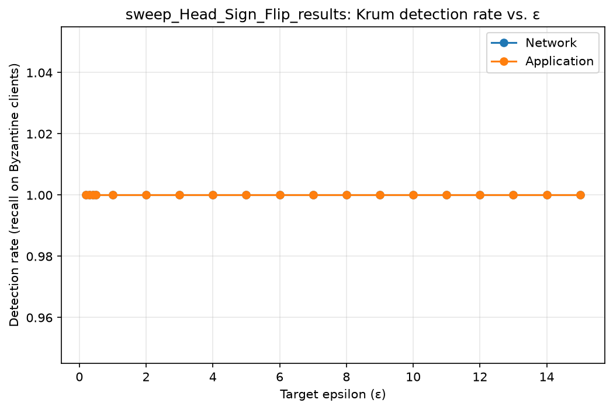
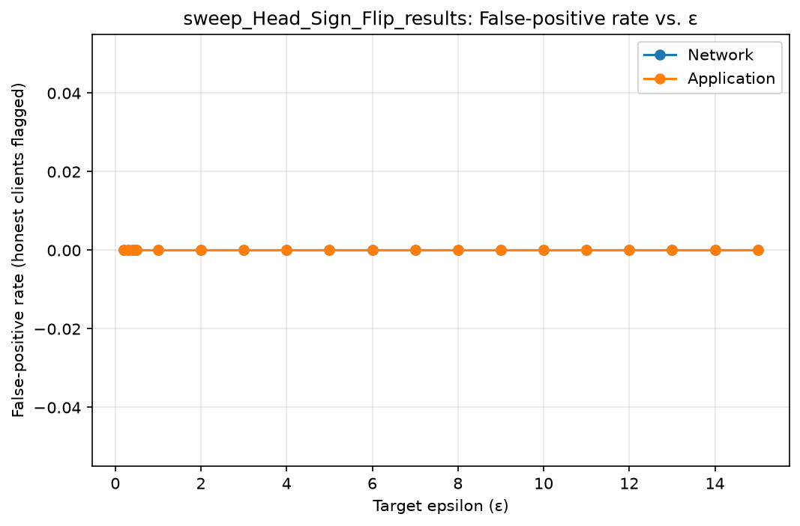
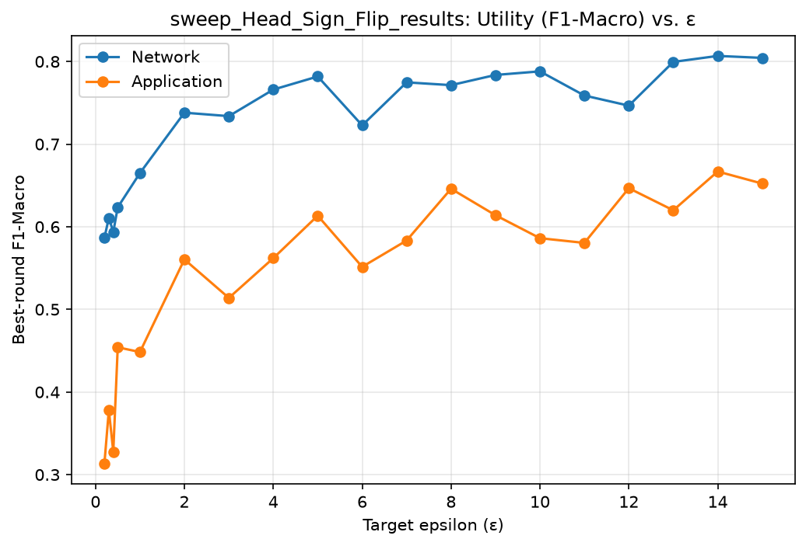
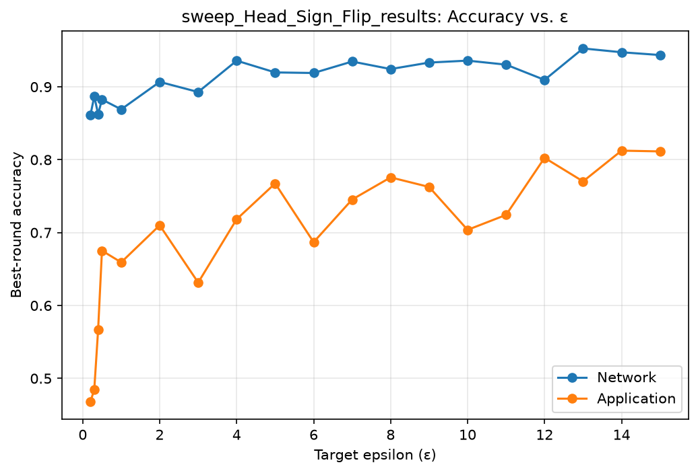
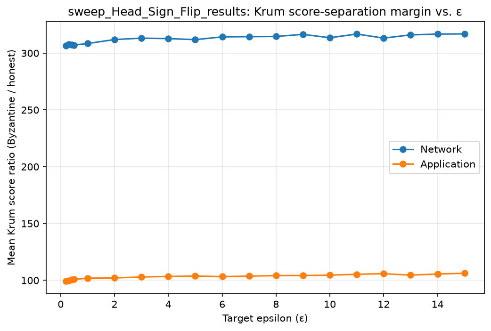
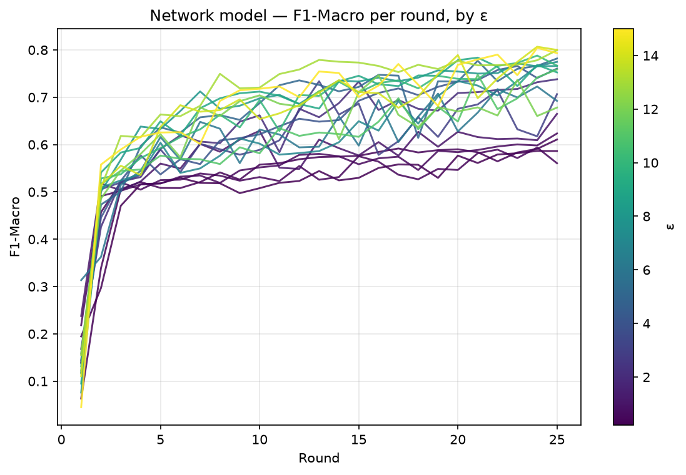
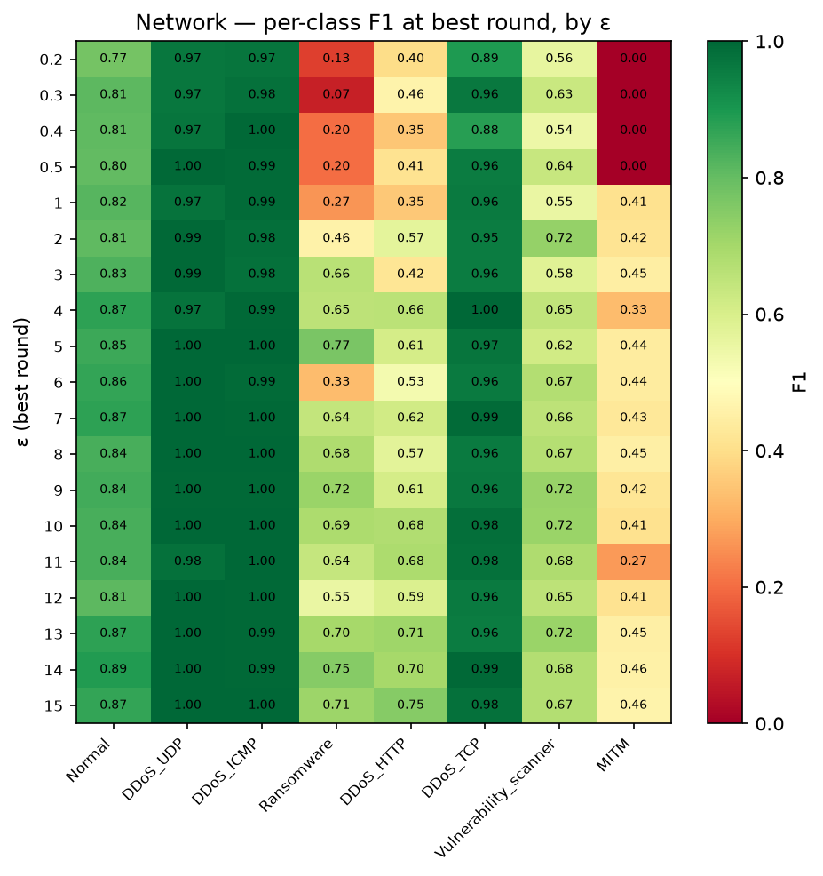
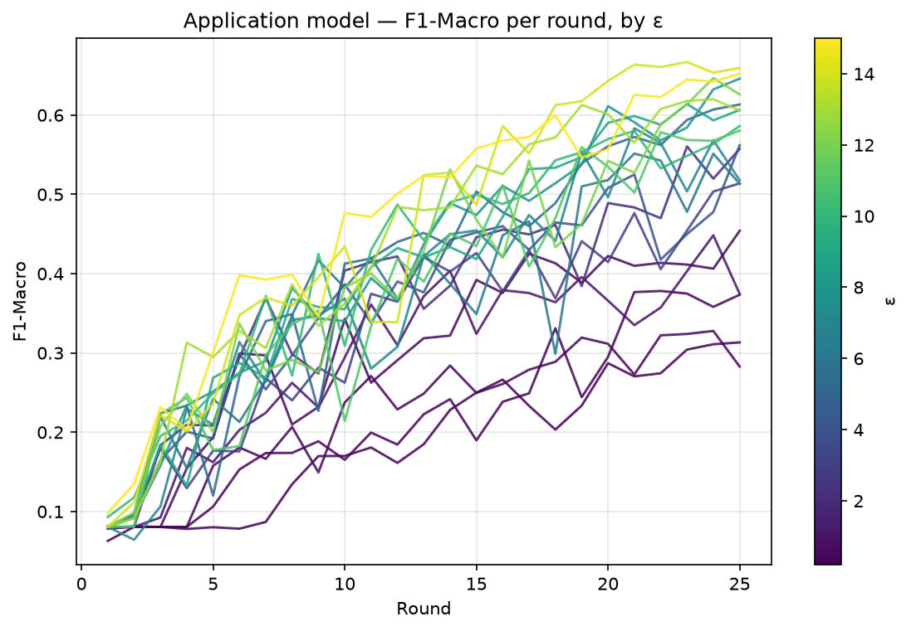
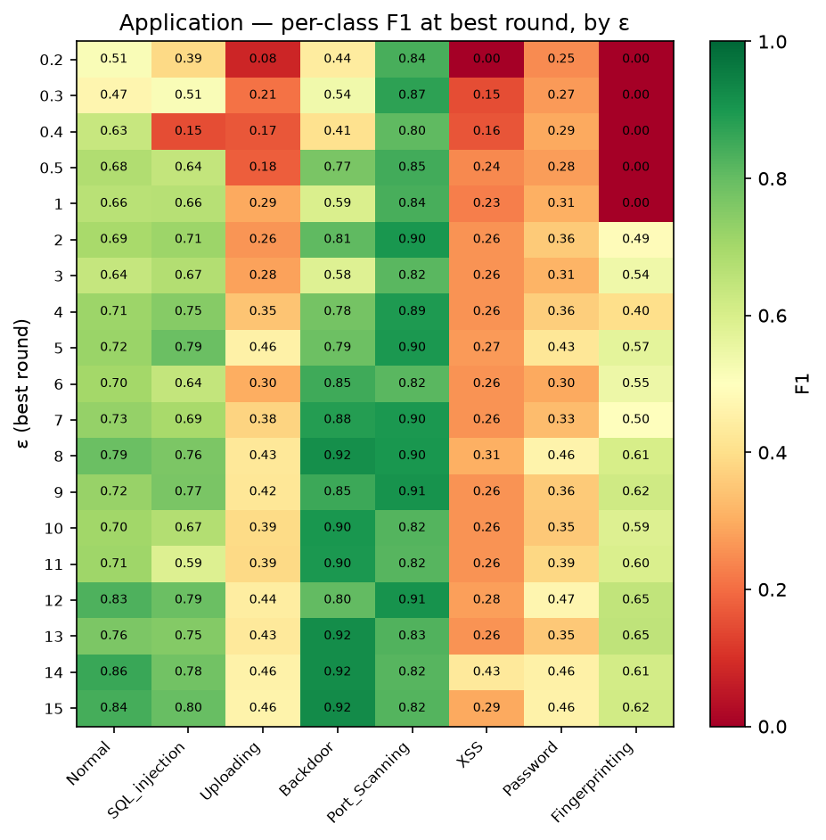

# sweep_Head_Sign_Flip_results — Automated Results Analysis

**Source folder:** `C:\Users\Zarawar Khan\09-edge-iot-security-monitoring\RESULTS AND MANIFESTS\Experiment 1\sweep_Head_Sign_Flip_results`  
**Files parsed:** 38 result CSV(s), 38 manifest JSON(s)  

This report was generated automatically. Every number in it was computed directly from the committed CSV files in the source folder above — nothing here is estimated, rounded from memory, or carried over from a prior write-up. Where something could not be computed (a missing column, an unparseable filename), it is stated explicitly rather than silently omitted.

---

## 1. Data Inventory

- **Application model:** 19 epsilon point(s) found: 0.2, 0.3, 0.4, 0.5, 1, 2, 3, 4, 5, 6, 7, 8, 9, 10, 11, 12, 13, 14, 15
- **Network model:** 19 epsilon point(s) found: 0.2, 0.3, 0.4, 0.5, 1, 2, 3, 4, 5, 6, 7, 8, 9, 10, 11, 12, 13, 14, 15

## 2. Krum Detection Performance vs. Epsilon

Ground-truth Byzantine clients assumed: 0-indexed `[0, 1]` (edit `BYZANTINE_CLIENTS_0INDEXED` at the top of the script if this is wrong for your sweep — check each manifest's `byzantine_clients` field in §6 to confirm).

| ε | Model | Detection rate | False-positive rate |
|---|---|---|---|
| 0.2 | application | 100.00% | 0.00% |
| 0.3 | application | 100.00% | 0.00% |
| 0.4 | application | 100.00% | 0.00% |
| 0.5 | application | 100.00% | 0.00% |
| 1 | application | 100.00% | 0.00% |
| 2 | application | 100.00% | 0.00% |
| 3 | application | 100.00% | 0.00% |
| 4 | application | 100.00% | 0.00% |
| 5 | application | 100.00% | 0.00% |
| 6 | application | 100.00% | 0.00% |
| 7 | application | 100.00% | 0.00% |
| 8 | application | 100.00% | 0.00% |
| 9 | application | 100.00% | 0.00% |
| 10 | application | 100.00% | 0.00% |
| 11 | application | 100.00% | 0.00% |
| 12 | application | 100.00% | 0.00% |
| 13 | application | 100.00% | 0.00% |
| 14 | application | 100.00% | 0.00% |
| 15 | application | 100.00% | 0.00% |
| 0.2 | network | 100.00% | 0.00% |
| 0.3 | network | 100.00% | 0.00% |
| 0.4 | network | 100.00% | 0.00% |
| 0.5 | network | 100.00% | 0.00% |
| 1 | network | 100.00% | 0.00% |
| 2 | network | 100.00% | 0.00% |
| 3 | network | 100.00% | 0.00% |
| 4 | network | 100.00% | 0.00% |
| 5 | network | 100.00% | 0.00% |
| 6 | network | 100.00% | 0.00% |
| 7 | network | 100.00% | 0.00% |
| 8 | network | 100.00% | 0.00% |
| 9 | network | 100.00% | 0.00% |
| 10 | network | 100.00% | 0.00% |
| 11 | network | 100.00% | 0.00% |
| 12 | network | 100.00% | 0.00% |
| 13 | network | 100.00% | 0.00% |
| 14 | network | 100.00% | 0.00% |
| 15 | network | 100.00% | 0.00% |





Detection rate was effectively 100% at every tested epsilon, for both models, in this sweep.

## 3. Utility vs. Epsilon

| ε | Model | Best round | Best F1-Macro | Best Accuracy | Mean round time (s) |
|---|---|---|---|---|---|
| 0.2 | application | 25 | 0.3133 | 0.4681 | 691.9 |
| 0.3 | application | 22 | 0.3782 | 0.4847 | 687.9 |
| 0.4 | application | 24 | 0.3278 | 0.5665 | 639.6 |
| 0.5 | application | 25 | 0.4541 | 0.6752 | 166.3 |
| 1 | application | 24 | 0.4484 | 0.6593 | 166.4 |
| 2 | application | 23 | 0.5605 | 0.7101 | 166.5 |
| 3 | application | 25 | 0.5139 | 0.6315 | 166.6 |
| 4 | application | 25 | 0.5620 | 0.7184 | 166.4 |
| 5 | application | 25 | 0.6134 | 0.7675 | 166.5 |
| 6 | application | 21 | 0.5515 | 0.6869 | 166.8 |
| 7 | application | 21 | 0.5834 | 0.7454 | 166.0 |
| 8 | application | 25 | 0.6460 | 0.7758 | 166.1 |
| 9 | application | 23 | 0.6140 | 0.7626 | 165.6 |
| 10 | application | 25 | 0.5862 | 0.7038 | 165.9 |
| 11 | application | 25 | 0.5805 | 0.7243 | 167.1 |
| 12 | application | 24 | 0.6467 | 0.8026 | 165.6 |
| 13 | application | 24 | 0.6199 | 0.7703 | 165.2 |
| 14 | application | 23 | 0.6669 | 0.8125 | 165.3 |
| 15 | application | 25 | 0.6523 | 0.8114 | 166.3 |
| 0.2 | network | 24 | 0.5866 | 0.8611 | 640.2 |
| 0.3 | network | 25 | 0.6107 | 0.8870 | 653.7 |
| 0.4 | network | 24 | 0.5937 | 0.8625 | 644.0 |
| 0.5 | network | 25 | 0.6235 | 0.8826 | 154.6 |
| 1 | network | 25 | 0.6650 | 0.8691 | 153.0 |
| 2 | network | 25 | 0.7381 | 0.9068 | 154.3 |
| 3 | network | 13 | 0.7339 | 0.8929 | 153.3 |
| 4 | network | 23 | 0.7660 | 0.9359 | 152.0 |
| 5 | network | 25 | 0.7819 | 0.9198 | 151.4 |
| 6 | network | 24 | 0.7227 | 0.9190 | 153.2 |
| 7 | network | 25 | 0.7748 | 0.9347 | 155.6 |
| 8 | network | 23 | 0.7714 | 0.9244 | 153.9 |
| 9 | network | 21 | 0.7837 | 0.9333 | 153.9 |
| 10 | network | 24 | 0.7881 | 0.9360 | 152.0 |
| 11 | network | 25 | 0.7588 | 0.9304 | 155.5 |
| 12 | network | 16 | 0.7466 | 0.9095 | 153.9 |
| 13 | network | 25 | 0.7995 | 0.9527 | 153.6 |
| 14 | network | 24 | 0.8068 | 0.9475 | 153.4 |
| 15 | network | 24 | 0.8044 | 0.9436 | 154.2 |





- **Application model — empirically best ε in this sweep:** ε=14 (F1-Macro=0.6669 at round 23). **Single-seed result — do not cite as a confirmed optimum without a repeat run (see §8).**
- **Network model — empirically best ε in this sweep:** ε=14 (F1-Macro=0.8068 at round 24). **Single-seed result — do not cite as a confirmed optimum without a repeat run (see §8).**

## 4. Krum Score-Separation Margin vs. Epsilon

`krum_score_ratio` = mean Byzantine Krum score / mean honest Krum score. A ratio near 1.0 means Krum cannot separate attackers from honest clients on a score basis (even if the MAD threshold still happens to catch them); a large ratio means a wide, robust separation margin.

| ε | Model | Mean Krum score ratio |
|---|---|---|
| 0.2 | application | 99.3352 |
| 0.3 | application | 99.9450 |
| 0.4 | application | 100.5054 |
| 0.5 | application | 100.7861 |
| 1 | application | 101.9300 |
| 2 | application | 102.0724 |
| 3 | application | 102.9580 |
| 4 | application | 103.4268 |
| 5 | application | 103.7939 |
| 6 | application | 103.3031 |
| 7 | application | 103.6991 |
| 8 | application | 104.1453 |
| 9 | application | 104.2660 |
| 10 | application | 104.5611 |
| 11 | application | 105.3147 |
| 12 | application | 105.8510 |
| 13 | application | 104.5578 |
| 14 | application | 105.5771 |
| 15 | application | 106.2433 |
| 0.2 | network | 306.4234 |
| 0.3 | network | 307.8979 |
| 0.4 | network | 307.3046 |
| 0.5 | network | 307.1342 |
| 1 | network | 308.4284 |
| 2 | network | 311.9295 |
| 3 | network | 313.1624 |
| 4 | network | 312.7740 |
| 5 | network | 311.8630 |
| 6 | network | 314.2643 |
| 7 | network | 314.4657 |
| 8 | network | 314.6493 |
| 9 | network | 316.4808 |
| 10 | network | 313.5333 |
| 11 | network | 316.7708 |
| 12 | network | 313.1902 |
| 13 | network | 316.0450 |
| 14 | network | 316.7340 |
| 15 | network | 316.9036 |



## 4.5. Timing Anomaly Diagnostics

6 of 38 file(s) have a mean round time more than 1.75x this sweep's median (165.6s) — flagged below with a round-1-vs-rest breakdown to distinguish a one-time setup cost (e.g. a privacy-noise calibration search that only runs once) from a sustained slowdown across the whole run (e.g. shared-machine resource contention during that run's execution window). These have very different implications for whether a round-time-vs-epsilon figure from this sweep is trustworthy to report as-is.

| ε | Model | Round 1 (s) | Rounds 2–25 mean (s) | Rounds 2–25 std (s) | Pattern |
|---|---|---|---|---|---|
| 0.2 | application | 656.0 | 693.4 | 14.1 | sustained (not a one-time round-1 spike) |
| 0.3 | application | 647.0 | 689.6 | 15.6 | sustained (not a one-time round-1 spike) |
| 0.4 | application | 615.7 | 640.6 | 17.8 | sustained (not a one-time round-1 spike) |
| 0.2 | network | 531.8 | 644.7 | 20.5 | sustained (not a one-time round-1 spike) |
| 0.3 | network | 690.2 | 652.1 | 11.4 | sustained (not a one-time round-1 spike) |
| 0.4 | network | 688.5 | 642.2 | 29.7 | sustained (not a one-time round-1 spike) |

**All flagged conditions show a sustained slowdown, not a one-time round-1 spike.** This rules out a one-time calibration-cost explanation — every round in these files is uniformly slow. The most likely cause is an execution-environment difference for these specific runs (e.g. shared-machine contention for their entire duration), not anything intrinsic to the epsilon value itself. **Do not report a round-time-vs-epsilon figure from this sweep without first checking whether the flagged files' original creation/execution timestamps cluster together** — that would confirm an environmental cause rather than an epsilon-dependent one.

## 5. Per-Round Trajectories & Per-Class Breakdown

### Network model





### Application model





## 6. Manifest-Derived Context

### `experiment_config_application_dp01.json`

(No fields matched this script's known manifest schema — raw content preserved below for manual review.)

```json
{
  "model_type": "application",
  "sanity_check": false,
  "num_rounds": 25,
  "num_clients": 10,
  "num_features_measured": 90,
  "local_epochs": 5,
  "learning_rate": 0.001,
  "prox_mu": 0.02,
  "byzantine_attack": true,
  "num_byzantine": 2,
  "byzantine_clients": [
    0,
    1
  ],
  "attack_scale": 2.0,
  "attack_type": "sign_flip",
  "gaussian_std": null,
  "attack_function": "sign_flip_attack_trained",
  "use_krum": false,
  "krum_m": 7,
  "krum_discards": 3,
  "use_adaptive_krum": true,
  "adaptive_krum_k": 2.5,
  "adaptive_krum_hybrid_assumed_f": 1,
  "byzantine_clients_cli_override": null,
  "adaptive_krum_method": "mad",
  "adaptive_krum_min_keep_fraction": 0.5,
  "use_he": false,
  "use_he_krum_hybrid": false,
  "use_head_norm_guard": true,
  "head_norm_guard_k": 2.5,
  "head_norm_guard_min_keep_fraction": 0.5,
  "he_poly_degree": null,
  "use_dp": true,
  "dp_epsilon": 1.0,
  "dp_delta": 1e-05,
  "dp_max_grad_norm": 1.5,
  "dp_batch_size": 512,
  "dp_accountant": "rdp",
  "use_zkp": false,
  "zkp_max_norm": 10.0,
  "byzantine_head_only": true,
  "dp_safe": true,
  "device": "cuda",
  "cuda_available": true,
  "client_pool_workers": 1,
  "threads_per_worker": 20,
  "framework": "custom Python simulation (direct, parallel client training)"
}
```

### `experiment_config_application_dp02.json`

(No fields matched this script's known manifest schema — raw content preserved below for manual review.)

```json
{
  "model_type": "application",
  "sanity_check": false,
  "num_rounds": 25,
  "num_clients": 10,
  "num_features_measured": 90,
  "local_epochs": 5,
  "learning_rate": 0.001,
  "prox_mu": 0.02,
  "byzantine_attack": true,
  "num_byzantine": 2,
  "byzantine_clients": [
    0,
    1
  ],
  "attack_scale": 2.0,
  "attack_type": "sign_flip",
  "gaussian_std": null,
  "attack_function": "sign_flip_attack_trained",
  "use_krum": false,
  "krum_m": 7,
  "krum_discards": 3,
  "use_adaptive_krum": true,
  "adaptive_krum_k": 2.5,
  "adaptive_krum_hybrid_assumed_f": 1,
  "byzantine_clients_cli_override": null,
  "adaptive_krum_method": "mad",
  "adaptive_krum_min_keep_fraction": 0.5,
  "use_he": false,
  "use_he_krum_hybrid": false,
  "use_head_norm_guard": true,
  "head_norm_guard_k": 2.5,
  "head_norm_guard_min_keep_fraction": 0.5,
  "he_poly_degree": null,
  "use_dp": true,
  "dp_epsilon": 2.0,
  "dp_delta": 1e-05,
  "dp_max_grad_norm": 1.5,
  "dp_batch_size": 512,
  "dp_accountant": "rdp",
  "use_zkp": false,
  "zkp_max_norm": 10.0,
  "byzantine_head_only": true,
  "dp_safe": true,
  "device": "cuda",
  "cuda_available": true,
  "client_pool_workers": 1,
  "threads_per_worker": 20,
  "framework": "custom Python simulation (direct, parallel client training)"
}
```

### `experiment_config_application_dp03.json`

(No fields matched this script's known manifest schema — raw content preserved below for manual review.)

```json
{
  "model_type": "application",
  "sanity_check": false,
  "num_rounds": 25,
  "num_clients": 10,
  "num_features_measured": 90,
  "local_epochs": 5,
  "learning_rate": 0.001,
  "prox_mu": 0.02,
  "byzantine_attack": true,
  "num_byzantine": 2,
  "byzantine_clients": [
    0,
    1
  ],
  "attack_scale": 2.0,
  "attack_type": "sign_flip",
  "gaussian_std": null,
  "attack_function": "sign_flip_attack_trained",
  "use_krum": false,
  "krum_m": 7,
  "krum_discards": 3,
  "use_adaptive_krum": true,
  "adaptive_krum_k": 2.5,
  "adaptive_krum_hybrid_assumed_f": 1,
  "byzantine_clients_cli_override": null,
  "adaptive_krum_method": "mad",
  "adaptive_krum_min_keep_fraction": 0.5,
  "use_he": false,
  "use_he_krum_hybrid": false,
  "use_head_norm_guard": true,
  "head_norm_guard_k": 2.5,
  "head_norm_guard_min_keep_fraction": 0.5,
  "he_poly_degree": null,
  "use_dp": true,
  "dp_epsilon": 3.0,
  "dp_delta": 1e-05,
  "dp_max_grad_norm": 1.5,
  "dp_batch_size": 512,
  "dp_accountant": "rdp",
  "use_zkp": false,
  "zkp_max_norm": 10.0,
  "byzantine_head_only": true,
  "dp_safe": true,
  "device": "cuda",
  "cuda_available": true,
  "client_pool_workers": 1,
  "threads_per_worker": 20,
  "framework": "custom Python simulation (direct, parallel client training)"
}
```

### `experiment_config_application_dp04.json`

(No fields matched this script's known manifest schema — raw content preserved below for manual review.)

```json
{
  "model_type": "application",
  "sanity_check": false,
  "num_rounds": 25,
  "num_clients": 10,
  "num_features_measured": 90,
  "local_epochs": 5,
  "learning_rate": 0.001,
  "prox_mu": 0.02,
  "byzantine_attack": true,
  "num_byzantine": 2,
  "byzantine_clients": [
    0,
    1
  ],
  "attack_scale": 2.0,
  "attack_type": "sign_flip",
  "gaussian_std": null,
  "attack_function": "sign_flip_attack_trained",
  "use_krum": false,
  "krum_m": 7,
  "krum_discards": 3,
  "use_adaptive_krum": true,
  "adaptive_krum_k": 2.5,
  "adaptive_krum_hybrid_assumed_f": 1,
  "byzantine_clients_cli_override": null,
  "adaptive_krum_method": "mad",
  "adaptive_krum_min_keep_fraction": 0.5,
  "use_he": false,
  "use_he_krum_hybrid": false,
  "use_head_norm_guard": true,
  "head_norm_guard_k": 2.5,
  "head_norm_guard_min_keep_fraction": 0.5,
  "he_poly_degree": null,
  "use_dp": true,
  "dp_epsilon": 4.0,
  "dp_delta": 1e-05,
  "dp_max_grad_norm": 1.5,
  "dp_batch_size": 512,
  "dp_accountant": "rdp",
  "use_zkp": false,
  "zkp_max_norm": 10.0,
  "byzantine_head_only": true,
  "dp_safe": true,
  "device": "cuda",
  "cuda_available": true,
  "client_pool_workers": 1,
  "threads_per_worker": 20,
  "framework": "custom Python simulation (direct, parallel client training)"
}
```

### `experiment_config_application_dp05.json`

(No fields matched this script's known manifest schema — raw content preserved below for manual review.)

```json
{
  "model_type": "application",
  "sanity_check": false,
  "num_rounds": 25,
  "num_clients": 10,
  "num_features_measured": 90,
  "local_epochs": 5,
  "learning_rate": 0.001,
  "prox_mu": 0.02,
  "byzantine_attack": true,
  "num_byzantine": 2,
  "byzantine_clients": [
    0,
    1
  ],
  "attack_scale": 2.0,
  "attack_type": "sign_flip",
  "gaussian_std": null,
  "attack_function": "sign_flip_attack_trained",
  "use_krum": false,
  "krum_m": 7,
  "krum_discards": 3,
  "use_adaptive_krum": true,
  "adaptive_krum_k": 2.5,
  "adaptive_krum_hybrid_assumed_f": 1,
  "byzantine_clients_cli_override": null,
  "adaptive_krum_method": "mad",
  "adaptive_krum_min_keep_fraction": 0.5,
  "use_he": false,
  "use_he_krum_hybrid": false,
  "use_head_norm_guard": true,
  "head_norm_guard_k": 2.5,
  "head_norm_guard_min_keep_fraction": 0.5,
  "he_poly_degree": null,
  "use_dp": true,
  "dp_epsilon": 5.0,
  "dp_delta": 1e-05,
  "dp_max_grad_norm": 1.5,
  "dp_batch_size": 512,
  "dp_accountant": "rdp",
  "use_zkp": false,
  "zkp_max_norm": 10.0,
  "byzantine_head_only": true,
  "dp_safe": true,
  "device": "cuda",
  "cuda_available": true,
  "client_pool_workers": 1,
  "threads_per_worker": 20,
  "framework": "custom Python simulation (direct, parallel client training)"
}
```

### `experiment_config_application_dp06.json`

(No fields matched this script's known manifest schema — raw content preserved below for manual review.)

```json
{
  "model_type": "application",
  "sanity_check": false,
  "num_rounds": 25,
  "num_clients": 10,
  "num_features_measured": 90,
  "local_epochs": 5,
  "learning_rate": 0.001,
  "prox_mu": 0.02,
  "byzantine_attack": true,
  "num_byzantine": 2,
  "byzantine_clients": [
    0,
    1
  ],
  "attack_scale": 2.0,
  "attack_type": "sign_flip",
  "gaussian_std": null,
  "attack_function": "sign_flip_attack_trained",
  "use_krum": false,
  "krum_m": 7,
  "krum_discards": 3,
  "use_adaptive_krum": true,
  "adaptive_krum_k": 2.5,
  "adaptive_krum_hybrid_assumed_f": 1,
  "byzantine_clients_cli_override": null,
  "adaptive_krum_method": "mad",
  "adaptive_krum_min_keep_fraction": 0.5,
  "use_he": false,
  "use_he_krum_hybrid": false,
  "use_head_norm_guard": true,
  "head_norm_guard_k": 2.5,
  "head_norm_guard_min_keep_fraction": 0.5,
  "he_poly_degree": null,
  "use_dp": true,
  "dp_epsilon": 6.0,
  "dp_delta": 1e-05,
  "dp_max_grad_norm": 1.5,
  "dp_batch_size": 512,
  "dp_accountant": "rdp",
  "use_zkp": false,
  "zkp_max_norm": 10.0,
  "byzantine_head_only": true,
  "dp_safe": true,
  "device": "cuda",
  "cuda_available": true,
  "client_pool_workers": 1,
  "threads_per_worker": 20,
  "framework": "custom Python simulation (direct, parallel client training)"
}
```

### `experiment_config_application_dp07.json`

(No fields matched this script's known manifest schema — raw content preserved below for manual review.)

```json
{
  "model_type": "application",
  "sanity_check": false,
  "num_rounds": 25,
  "num_clients": 10,
  "num_features_measured": 90,
  "local_epochs": 5,
  "learning_rate": 0.001,
  "prox_mu": 0.02,
  "byzantine_attack": true,
  "num_byzantine": 2,
  "byzantine_clients": [
    0,
    1
  ],
  "attack_scale": 2.0,
  "attack_type": "sign_flip",
  "gaussian_std": null,
  "attack_function": "sign_flip_attack_trained",
  "use_krum": false,
  "krum_m": 7,
  "krum_discards": 3,
  "use_adaptive_krum": true,
  "adaptive_krum_k": 2.5,
  "adaptive_krum_hybrid_assumed_f": 1,
  "byzantine_clients_cli_override": null,
  "adaptive_krum_method": "mad",
  "adaptive_krum_min_keep_fraction": 0.5,
  "use_he": false,
  "use_he_krum_hybrid": false,
  "use_head_norm_guard": true,
  "head_norm_guard_k": 2.5,
  "head_norm_guard_min_keep_fraction": 0.5,
  "he_poly_degree": null,
  "use_dp": true,
  "dp_epsilon": 7.0,
  "dp_delta": 1e-05,
  "dp_max_grad_norm": 1.5,
  "dp_batch_size": 512,
  "dp_accountant": "rdp",
  "use_zkp": false,
  "zkp_max_norm": 10.0,
  "byzantine_head_only": true,
  "dp_safe": true,
  "device": "cuda",
  "cuda_available": true,
  "client_pool_workers": 1,
  "threads_per_worker": 20,
  "framework": "custom Python simulation (direct, parallel client training)"
}
```

### `experiment_config_application_dp08.json`

(No fields matched this script's known manifest schema — raw content preserved below for manual review.)

```json
{
  "model_type": "application",
  "sanity_check": false,
  "num_rounds": 25,
  "num_clients": 10,
  "num_features_measured": 90,
  "local_epochs": 5,
  "learning_rate": 0.001,
  "prox_mu": 0.02,
  "byzantine_attack": true,
  "num_byzantine": 2,
  "byzantine_clients": [
    0,
    1
  ],
  "attack_scale": 2.0,
  "attack_type": "sign_flip",
  "gaussian_std": null,
  "attack_function": "sign_flip_attack_trained",
  "use_krum": false,
  "krum_m": 7,
  "krum_discards": 3,
  "use_adaptive_krum": true,
  "adaptive_krum_k": 2.5,
  "adaptive_krum_hybrid_assumed_f": 1,
  "byzantine_clients_cli_override": null,
  "adaptive_krum_method": "mad",
  "adaptive_krum_min_keep_fraction": 0.5,
  "use_he": false,
  "use_he_krum_hybrid": false,
  "use_head_norm_guard": true,
  "head_norm_guard_k": 2.5,
  "head_norm_guard_min_keep_fraction": 0.5,
  "he_poly_degree": null,
  "use_dp": true,
  "dp_epsilon": 8.0,
  "dp_delta": 1e-05,
  "dp_max_grad_norm": 1.5,
  "dp_batch_size": 512,
  "dp_accountant": "rdp",
  "use_zkp": false,
  "zkp_max_norm": 10.0,
  "byzantine_head_only": true,
  "dp_safe": true,
  "device": "cuda",
  "cuda_available": true,
  "client_pool_workers": 1,
  "threads_per_worker": 20,
  "framework": "custom Python simulation (direct, parallel client training)"
}
```

### `experiment_config_application_dp09.json`

(No fields matched this script's known manifest schema — raw content preserved below for manual review.)

```json
{
  "model_type": "application",
  "sanity_check": false,
  "num_rounds": 25,
  "num_clients": 10,
  "num_features_measured": 90,
  "local_epochs": 5,
  "learning_rate": 0.001,
  "prox_mu": 0.02,
  "byzantine_attack": true,
  "num_byzantine": 2,
  "byzantine_clients": [
    0,
    1
  ],
  "attack_scale": 2.0,
  "attack_type": "sign_flip",
  "gaussian_std": null,
  "attack_function": "sign_flip_attack_trained",
  "use_krum": false,
  "krum_m": 7,
  "krum_discards": 3,
  "use_adaptive_krum": true,
  "adaptive_krum_k": 2.5,
  "adaptive_krum_hybrid_assumed_f": 1,
  "byzantine_clients_cli_override": null,
  "adaptive_krum_method": "mad",
  "adaptive_krum_min_keep_fraction": 0.5,
  "use_he": false,
  "use_he_krum_hybrid": false,
  "use_head_norm_guard": true,
  "head_norm_guard_k": 2.5,
  "head_norm_guard_min_keep_fraction": 0.5,
  "he_poly_degree": null,
  "use_dp": true,
  "dp_epsilon": 9.0,
  "dp_delta": 1e-05,
  "dp_max_grad_norm": 1.5,
  "dp_batch_size": 512,
  "dp_accountant": "rdp",
  "use_zkp": false,
  "zkp_max_norm": 10.0,
  "byzantine_head_only": true,
  "dp_safe": true,
  "device": "cuda",
  "cuda_available": true,
  "client_pool_workers": 1,
  "threads_per_worker": 20,
  "framework": "custom Python simulation (direct, parallel client training)"
}
```

### `experiment_config_application_dp0p2.json`

(No fields matched this script's known manifest schema — raw content preserved below for manual review.)

```json
{
  "ablation_mode": "krum_dp_sweep",
  "model_type": "application",
  "sanity_check": false,
  "num_rounds": 25,
  "num_clients": 10,
  "num_features_measured": 90,
  "local_epochs": 5,
  "learning_rate": 0.001,
  "prox_mu": 0.02,
  "byzantine_attack": true,
  "num_byzantine": 2,
  "byzantine_clients": [
    0,
    1
  ],
  "attack_scale": 2.0,
  "attack_type": "sign_flip",
  "gaussian_std": null,
  "attack_function": "sign_flip_attack_trained",
  "use_krum": false,
  "krum_m": 7,
  "krum_discards": 3,
  "use_adaptive_krum": true,
  "adaptive_krum_k": 2.5,
  "adaptive_krum_hybrid_assumed_f": 1,
  "byzantine_clients_cli_override": null,
  "adaptive_krum_method": "mad",
  "adaptive_krum_min_keep_fraction": 0.5,
  "use_he": false,
  "use_he_krum_hybrid": false,
  "use_zkp": false,
  "use_head_norm_guard": true,
  "head_norm_guard_k": 2.5,
  "head_norm_guard_min_keep_fraction": 0.5,
  "he_poly_degree": null,
  "use_dp": true,
  "dp_epsilon": 0.2,
  "dp_delta": 1e-05,
  "dp_max_grad_norm": 1.5,
  "dp_batch_size": 512,
  "dp_accountant": "rdp",
  "byzantine_head_only": false,
  "dp_safe": true,
  "device": "cuda",
  "cuda_available": true,
  "client_pool_workers": 1,
  "threads_per_worker": 20,
  "framework": "custom Python simulation (direct, parallel client training)"
}
```

### `experiment_config_application_dp0p3.json`

(No fields matched this script's known manifest schema — raw content preserved below for manual review.)

```json
{
  "ablation_mode": "krum_dp_sweep",
  "model_type": "application",
  "sanity_check": false,
  "num_rounds": 25,
  "num_clients": 10,
  "num_features_measured": 90,
  "local_epochs": 5,
  "learning_rate": 0.001,
  "prox_mu": 0.02,
  "byzantine_attack": true,
  "num_byzantine": 2,
  "byzantine_clients": [
    0,
    1
  ],
  "attack_scale": 2.0,
  "attack_type": "sign_flip",
  "gaussian_std": null,
  "attack_function": "sign_flip_attack_trained",
  "use_krum": false,
  "krum_m": 7,
  "krum_discards": 3,
  "use_adaptive_krum": true,
  "adaptive_krum_k": 2.5,
  "adaptive_krum_hybrid_assumed_f": 1,
  "byzantine_clients_cli_override": null,
  "adaptive_krum_method": "mad",
  "adaptive_krum_min_keep_fraction": 0.5,
  "use_he": false,
  "use_he_krum_hybrid": false,
  "use_zkp": false,
  "use_head_norm_guard": true,
  "head_norm_guard_k": 2.5,
  "head_norm_guard_min_keep_fraction": 0.5,
  "he_poly_degree": null,
  "use_dp": true,
  "dp_epsilon": 0.3,
  "dp_delta": 1e-05,
  "dp_max_grad_norm": 1.5,
  "dp_batch_size": 512,
  "dp_accountant": "rdp",
  "byzantine_head_only": false,
  "dp_safe": true,
  "device": "cuda",
  "cuda_available": true,
  "client_pool_workers": 1,
  "threads_per_worker": 20,
  "framework": "custom Python simulation (direct, parallel client training)"
}
```

### `experiment_config_application_dp0p4.json`

(No fields matched this script's known manifest schema — raw content preserved below for manual review.)

```json
{
  "ablation_mode": "krum_dp_sweep",
  "model_type": "application",
  "sanity_check": false,
  "num_rounds": 25,
  "num_clients": 10,
  "num_features_measured": 90,
  "local_epochs": 5,
  "learning_rate": 0.001,
  "prox_mu": 0.02,
  "byzantine_attack": true,
  "num_byzantine": 2,
  "byzantine_clients": [
    0,
    1
  ],
  "attack_scale": 2.0,
  "attack_type": "sign_flip",
  "gaussian_std": null,
  "attack_function": "sign_flip_attack_trained",
  "use_krum": false,
  "krum_m": 7,
  "krum_discards": 3,
  "use_adaptive_krum": true,
  "adaptive_krum_k": 2.5,
  "adaptive_krum_hybrid_assumed_f": 1,
  "byzantine_clients_cli_override": null,
  "adaptive_krum_method": "mad",
  "adaptive_krum_min_keep_fraction": 0.5,
  "use_he": false,
  "use_he_krum_hybrid": false,
  "use_zkp": false,
  "use_head_norm_guard": true,
  "head_norm_guard_k": 2.5,
  "head_norm_guard_min_keep_fraction": 0.5,
  "he_poly_degree": null,
  "use_dp": true,
  "dp_epsilon": 0.4,
  "dp_delta": 1e-05,
  "dp_max_grad_norm": 1.5,
  "dp_batch_size": 512,
  "dp_accountant": "rdp",
  "byzantine_head_only": false,
  "dp_safe": true,
  "device": "cuda",
  "cuda_available": true,
  "client_pool_workers": 1,
  "threads_per_worker": 20,
  "framework": "custom Python simulation (direct, parallel client training)"
}
```

### `experiment_config_application_dp0p5.json`

(No fields matched this script's known manifest schema — raw content preserved below for manual review.)

```json
{
  "model_type": "application",
  "sanity_check": false,
  "num_rounds": 25,
  "num_clients": 10,
  "num_features_measured": 90,
  "local_epochs": 5,
  "learning_rate": 0.001,
  "prox_mu": 0.02,
  "byzantine_attack": true,
  "num_byzantine": 2,
  "byzantine_clients": [
    0,
    1
  ],
  "attack_scale": 2.0,
  "attack_type": "sign_flip",
  "gaussian_std": null,
  "attack_function": "sign_flip_attack_trained",
  "use_krum": false,
  "krum_m": 7,
  "krum_discards": 3,
  "use_adaptive_krum": true,
  "adaptive_krum_k": 2.5,
  "adaptive_krum_hybrid_assumed_f": 1,
  "byzantine_clients_cli_override": null,
  "adaptive_krum_method": "mad",
  "adaptive_krum_min_keep_fraction": 0.5,
  "use_he": false,
  "use_he_krum_hybrid": false,
  "use_head_norm_guard": true,
  "head_norm_guard_k": 2.5,
  "head_norm_guard_min_keep_fraction": 0.5,
  "he_poly_degree": null,
  "use_dp": true,
  "dp_epsilon": 0.5,
  "dp_delta": 1e-05,
  "dp_max_grad_norm": 1.5,
  "dp_batch_size": 512,
  "dp_accountant": "rdp",
  "use_zkp": false,
  "zkp_max_norm": 10.0,
  "byzantine_head_only": true,
  "dp_safe": true,
  "device": "cuda",
  "cuda_available": true,
  "client_pool_workers": 1,
  "threads_per_worker": 20,
  "framework": "custom Python simulation (direct, parallel client training)"
}
```

### `experiment_config_application_dp10.json`

(No fields matched this script's known manifest schema — raw content preserved below for manual review.)

```json
{
  "model_type": "application",
  "sanity_check": false,
  "num_rounds": 25,
  "num_clients": 10,
  "num_features_measured": 90,
  "local_epochs": 5,
  "learning_rate": 0.001,
  "prox_mu": 0.02,
  "byzantine_attack": true,
  "num_byzantine": 2,
  "byzantine_clients": [
    0,
    1
  ],
  "attack_scale": 2.0,
  "attack_type": "sign_flip",
  "gaussian_std": null,
  "attack_function": "sign_flip_attack_trained",
  "use_krum": false,
  "krum_m": 7,
  "krum_discards": 3,
  "use_adaptive_krum": true,
  "adaptive_krum_k": 2.5,
  "adaptive_krum_hybrid_assumed_f": 1,
  "byzantine_clients_cli_override": null,
  "adaptive_krum_method": "mad",
  "adaptive_krum_min_keep_fraction": 0.5,
  "use_he": false,
  "use_he_krum_hybrid": false,
  "use_head_norm_guard": true,
  "head_norm_guard_k": 2.5,
  "head_norm_guard_min_keep_fraction": 0.5,
  "he_poly_degree": null,
  "use_dp": true,
  "dp_epsilon": 10.0,
  "dp_delta": 1e-05,
  "dp_max_grad_norm": 1.5,
  "dp_batch_size": 512,
  "dp_accountant": "rdp",
  "use_zkp": false,
  "zkp_max_norm": 10.0,
  "byzantine_head_only": true,
  "dp_safe": true,
  "device": "cuda",
  "cuda_available": true,
  "client_pool_workers": 1,
  "threads_per_worker": 20,
  "framework": "custom Python simulation (direct, parallel client training)"
}
```

### `experiment_config_application_dp11.json`

(No fields matched this script's known manifest schema — raw content preserved below for manual review.)

```json
{
  "model_type": "application",
  "sanity_check": false,
  "num_rounds": 25,
  "num_clients": 10,
  "num_features_measured": 90,
  "local_epochs": 5,
  "learning_rate": 0.001,
  "prox_mu": 0.02,
  "byzantine_attack": true,
  "num_byzantine": 2,
  "byzantine_clients": [
    0,
    1
  ],
  "attack_scale": 2.0,
  "attack_type": "sign_flip",
  "gaussian_std": null,
  "attack_function": "sign_flip_attack_trained",
  "use_krum": false,
  "krum_m": 7,
  "krum_discards": 3,
  "use_adaptive_krum": true,
  "adaptive_krum_k": 2.5,
  "adaptive_krum_hybrid_assumed_f": 1,
  "byzantine_clients_cli_override": null,
  "adaptive_krum_method": "mad",
  "adaptive_krum_min_keep_fraction": 0.5,
  "use_he": false,
  "use_he_krum_hybrid": false,
  "use_head_norm_guard": true,
  "head_norm_guard_k": 2.5,
  "head_norm_guard_min_keep_fraction": 0.5,
  "he_poly_degree": null,
  "use_dp": true,
  "dp_epsilon": 11.0,
  "dp_delta": 1e-05,
  "dp_max_grad_norm": 1.5,
  "dp_batch_size": 512,
  "dp_accountant": "rdp",
  "use_zkp": false,
  "zkp_max_norm": 10.0,
  "byzantine_head_only": true,
  "dp_safe": true,
  "device": "cuda",
  "cuda_available": true,
  "client_pool_workers": 1,
  "threads_per_worker": 20,
  "framework": "custom Python simulation (direct, parallel client training)"
}
```

### `experiment_config_application_dp12.json`

(No fields matched this script's known manifest schema — raw content preserved below for manual review.)

```json
{
  "model_type": "application",
  "sanity_check": false,
  "num_rounds": 25,
  "num_clients": 10,
  "num_features_measured": 90,
  "local_epochs": 5,
  "learning_rate": 0.001,
  "prox_mu": 0.02,
  "byzantine_attack": true,
  "num_byzantine": 2,
  "byzantine_clients": [
    0,
    1
  ],
  "attack_scale": 2.0,
  "attack_type": "sign_flip",
  "gaussian_std": null,
  "attack_function": "sign_flip_attack_trained",
  "use_krum": false,
  "krum_m": 7,
  "krum_discards": 3,
  "use_adaptive_krum": true,
  "adaptive_krum_k": 2.5,
  "adaptive_krum_hybrid_assumed_f": 1,
  "byzantine_clients_cli_override": null,
  "adaptive_krum_method": "mad",
  "adaptive_krum_min_keep_fraction": 0.5,
  "use_he": false,
  "use_he_krum_hybrid": false,
  "use_head_norm_guard": true,
  "head_norm_guard_k": 2.5,
  "head_norm_guard_min_keep_fraction": 0.5,
  "he_poly_degree": null,
  "use_dp": true,
  "dp_epsilon": 12.0,
  "dp_delta": 1e-05,
  "dp_max_grad_norm": 1.5,
  "dp_batch_size": 512,
  "dp_accountant": "rdp",
  "use_zkp": false,
  "zkp_max_norm": 10.0,
  "byzantine_head_only": true,
  "dp_safe": true,
  "device": "cuda",
  "cuda_available": true,
  "client_pool_workers": 1,
  "threads_per_worker": 20,
  "framework": "custom Python simulation (direct, parallel client training)"
}
```

### `experiment_config_application_dp13.json`

(No fields matched this script's known manifest schema — raw content preserved below for manual review.)

```json
{
  "model_type": "application",
  "sanity_check": false,
  "num_rounds": 25,
  "num_clients": 10,
  "num_features_measured": 90,
  "local_epochs": 5,
  "learning_rate": 0.001,
  "prox_mu": 0.02,
  "byzantine_attack": true,
  "num_byzantine": 2,
  "byzantine_clients": [
    0,
    1
  ],
  "attack_scale": 2.0,
  "attack_type": "sign_flip",
  "gaussian_std": null,
  "attack_function": "sign_flip_attack_trained",
  "use_krum": false,
  "krum_m": 7,
  "krum_discards": 3,
  "use_adaptive_krum": true,
  "adaptive_krum_k": 2.5,
  "adaptive_krum_hybrid_assumed_f": 1,
  "byzantine_clients_cli_override": null,
  "adaptive_krum_method": "mad",
  "adaptive_krum_min_keep_fraction": 0.5,
  "use_he": false,
  "use_he_krum_hybrid": false,
  "use_head_norm_guard": true,
  "head_norm_guard_k": 2.5,
  "head_norm_guard_min_keep_fraction": 0.5,
  "he_poly_degree": null,
  "use_dp": true,
  "dp_epsilon": 13.0,
  "dp_delta": 1e-05,
  "dp_max_grad_norm": 1.5,
  "dp_batch_size": 512,
  "dp_accountant": "rdp",
  "use_zkp": false,
  "zkp_max_norm": 10.0,
  "byzantine_head_only": true,
  "dp_safe": true,
  "device": "cuda",
  "cuda_available": true,
  "client_pool_workers": 1,
  "threads_per_worker": 20,
  "framework": "custom Python simulation (direct, parallel client training)"
}
```

### `experiment_config_application_dp14.json`

(No fields matched this script's known manifest schema — raw content preserved below for manual review.)

```json
{
  "model_type": "application",
  "sanity_check": false,
  "num_rounds": 25,
  "num_clients": 10,
  "num_features_measured": 90,
  "local_epochs": 5,
  "learning_rate": 0.001,
  "prox_mu": 0.02,
  "byzantine_attack": true,
  "num_byzantine": 2,
  "byzantine_clients": [
    0,
    1
  ],
  "attack_scale": 2.0,
  "attack_type": "sign_flip",
  "gaussian_std": null,
  "attack_function": "sign_flip_attack_trained",
  "use_krum": false,
  "krum_m": 7,
  "krum_discards": 3,
  "use_adaptive_krum": true,
  "adaptive_krum_k": 2.5,
  "adaptive_krum_hybrid_assumed_f": 1,
  "byzantine_clients_cli_override": null,
  "adaptive_krum_method": "mad",
  "adaptive_krum_min_keep_fraction": 0.5,
  "use_he": false,
  "use_he_krum_hybrid": false,
  "use_head_norm_guard": true,
  "head_norm_guard_k": 2.5,
  "head_norm_guard_min_keep_fraction": 0.5,
  "he_poly_degree": null,
  "use_dp": true,
  "dp_epsilon": 14.0,
  "dp_delta": 1e-05,
  "dp_max_grad_norm": 1.5,
  "dp_batch_size": 512,
  "dp_accountant": "rdp",
  "use_zkp": false,
  "zkp_max_norm": 10.0,
  "byzantine_head_only": true,
  "dp_safe": true,
  "device": "cuda",
  "cuda_available": true,
  "client_pool_workers": 1,
  "threads_per_worker": 20,
  "framework": "custom Python simulation (direct, parallel client training)"
}
```

### `experiment_config_application_dp15.json`

(No fields matched this script's known manifest schema — raw content preserved below for manual review.)

```json
{
  "model_type": "application",
  "sanity_check": false,
  "num_rounds": 25,
  "num_clients": 10,
  "num_features_measured": 90,
  "local_epochs": 5,
  "learning_rate": 0.001,
  "prox_mu": 0.02,
  "byzantine_attack": true,
  "num_byzantine": 2,
  "byzantine_clients": [
    0,
    1
  ],
  "attack_scale": 2.0,
  "attack_type": "sign_flip",
  "gaussian_std": null,
  "attack_function": "sign_flip_attack_trained",
  "use_krum": false,
  "krum_m": 7,
  "krum_discards": 3,
  "use_adaptive_krum": true,
  "adaptive_krum_k": 2.5,
  "adaptive_krum_hybrid_assumed_f": 1,
  "byzantine_clients_cli_override": null,
  "adaptive_krum_method": "mad",
  "adaptive_krum_min_keep_fraction": 0.5,
  "use_he": false,
  "use_he_krum_hybrid": false,
  "use_head_norm_guard": true,
  "head_norm_guard_k": 2.5,
  "head_norm_guard_min_keep_fraction": 0.5,
  "he_poly_degree": null,
  "use_dp": true,
  "dp_epsilon": 15.0,
  "dp_delta": 1e-05,
  "dp_max_grad_norm": 1.5,
  "dp_batch_size": 512,
  "dp_accountant": "rdp",
  "use_zkp": false,
  "zkp_max_norm": 10.0,
  "byzantine_head_only": true,
  "dp_safe": true,
  "device": "cuda",
  "cuda_available": true,
  "client_pool_workers": 1,
  "threads_per_worker": 20,
  "framework": "custom Python simulation (direct, parallel client training)"
}
```

### `experiment_config_network_dp01.json`

(No fields matched this script's known manifest schema — raw content preserved below for manual review.)

```json
{
  "model_type": "network",
  "sanity_check": false,
  "num_rounds": 25,
  "num_clients": 10,
  "num_features_measured": 39,
  "local_epochs": 5,
  "learning_rate": 0.001,
  "prox_mu": 0.02,
  "byzantine_attack": true,
  "num_byzantine": 2,
  "byzantine_clients": [
    0,
    1
  ],
  "attack_scale": 5.0,
  "attack_type": "sign_flip",
  "gaussian_std": null,
  "attack_function": "sign_flip_attack_trained",
  "use_krum": false,
  "krum_m": 7,
  "krum_discards": 3,
  "use_adaptive_krum": true,
  "adaptive_krum_k": 2.5,
  "adaptive_krum_hybrid_assumed_f": 1,
  "byzantine_clients_cli_override": null,
  "adaptive_krum_method": "mad",
  "adaptive_krum_min_keep_fraction": 0.5,
  "use_he": false,
  "use_he_krum_hybrid": false,
  "use_head_norm_guard": true,
  "head_norm_guard_k": 2.5,
  "head_norm_guard_min_keep_fraction": 0.5,
  "he_poly_degree": null,
  "use_dp": true,
  "dp_epsilon": 1.0,
  "dp_delta": 1e-05,
  "dp_max_grad_norm": 1.5,
  "dp_batch_size": 512,
  "dp_accountant": "rdp",
  "use_zkp": false,
  "zkp_max_norm": 10.0,
  "byzantine_head_only": true,
  "dp_safe": true,
  "device": "cuda",
  "cuda_available": true,
  "client_pool_workers": 1,
  "threads_per_worker": 20,
  "framework": "custom Python simulation (direct, parallel client training)"
}
```

### `experiment_config_network_dp02.json`

(No fields matched this script's known manifest schema — raw content preserved below for manual review.)

```json
{
  "model_type": "network",
  "sanity_check": false,
  "num_rounds": 25,
  "num_clients": 10,
  "num_features_measured": 39,
  "local_epochs": 5,
  "learning_rate": 0.001,
  "prox_mu": 0.02,
  "byzantine_attack": true,
  "num_byzantine": 2,
  "byzantine_clients": [
    0,
    1
  ],
  "attack_scale": 5.0,
  "attack_type": "sign_flip",
  "gaussian_std": null,
  "attack_function": "sign_flip_attack_trained",
  "use_krum": false,
  "krum_m": 7,
  "krum_discards": 3,
  "use_adaptive_krum": true,
  "adaptive_krum_k": 2.5,
  "adaptive_krum_hybrid_assumed_f": 1,
  "byzantine_clients_cli_override": null,
  "adaptive_krum_method": "mad",
  "adaptive_krum_min_keep_fraction": 0.5,
  "use_he": false,
  "use_he_krum_hybrid": false,
  "use_head_norm_guard": true,
  "head_norm_guard_k": 2.5,
  "head_norm_guard_min_keep_fraction": 0.5,
  "he_poly_degree": null,
  "use_dp": true,
  "dp_epsilon": 2.0,
  "dp_delta": 1e-05,
  "dp_max_grad_norm": 1.5,
  "dp_batch_size": 512,
  "dp_accountant": "rdp",
  "use_zkp": false,
  "zkp_max_norm": 10.0,
  "byzantine_head_only": true,
  "dp_safe": true,
  "device": "cuda",
  "cuda_available": true,
  "client_pool_workers": 1,
  "threads_per_worker": 20,
  "framework": "custom Python simulation (direct, parallel client training)"
}
```

### `experiment_config_network_dp03.json`

(No fields matched this script's known manifest schema — raw content preserved below for manual review.)

```json
{
  "model_type": "network",
  "sanity_check": false,
  "num_rounds": 25,
  "num_clients": 10,
  "num_features_measured": 39,
  "local_epochs": 5,
  "learning_rate": 0.001,
  "prox_mu": 0.02,
  "byzantine_attack": true,
  "num_byzantine": 2,
  "byzantine_clients": [
    0,
    1
  ],
  "attack_scale": 5.0,
  "attack_type": "sign_flip",
  "gaussian_std": null,
  "attack_function": "sign_flip_attack_trained",
  "use_krum": false,
  "krum_m": 7,
  "krum_discards": 3,
  "use_adaptive_krum": true,
  "adaptive_krum_k": 2.5,
  "adaptive_krum_hybrid_assumed_f": 1,
  "byzantine_clients_cli_override": null,
  "adaptive_krum_method": "mad",
  "adaptive_krum_min_keep_fraction": 0.5,
  "use_he": false,
  "use_he_krum_hybrid": false,
  "use_head_norm_guard": true,
  "head_norm_guard_k": 2.5,
  "head_norm_guard_min_keep_fraction": 0.5,
  "he_poly_degree": null,
  "use_dp": true,
  "dp_epsilon": 3.0,
  "dp_delta": 1e-05,
  "dp_max_grad_norm": 1.5,
  "dp_batch_size": 512,
  "dp_accountant": "rdp",
  "use_zkp": false,
  "zkp_max_norm": 10.0,
  "byzantine_head_only": true,
  "dp_safe": true,
  "device": "cuda",
  "cuda_available": true,
  "client_pool_workers": 1,
  "threads_per_worker": 20,
  "framework": "custom Python simulation (direct, parallel client training)"
}
```

### `experiment_config_network_dp04.json`

(No fields matched this script's known manifest schema — raw content preserved below for manual review.)

```json
{
  "model_type": "network",
  "sanity_check": false,
  "num_rounds": 25,
  "num_clients": 10,
  "num_features_measured": 39,
  "local_epochs": 5,
  "learning_rate": 0.001,
  "prox_mu": 0.02,
  "byzantine_attack": true,
  "num_byzantine": 2,
  "byzantine_clients": [
    0,
    1
  ],
  "attack_scale": 5.0,
  "attack_type": "sign_flip",
  "gaussian_std": null,
  "attack_function": "sign_flip_attack_trained",
  "use_krum": false,
  "krum_m": 7,
  "krum_discards": 3,
  "use_adaptive_krum": true,
  "adaptive_krum_k": 2.5,
  "adaptive_krum_hybrid_assumed_f": 1,
  "byzantine_clients_cli_override": null,
  "adaptive_krum_method": "mad",
  "adaptive_krum_min_keep_fraction": 0.5,
  "use_he": false,
  "use_he_krum_hybrid": false,
  "use_head_norm_guard": true,
  "head_norm_guard_k": 2.5,
  "head_norm_guard_min_keep_fraction": 0.5,
  "he_poly_degree": null,
  "use_dp": true,
  "dp_epsilon": 4.0,
  "dp_delta": 1e-05,
  "dp_max_grad_norm": 1.5,
  "dp_batch_size": 512,
  "dp_accountant": "rdp",
  "use_zkp": false,
  "zkp_max_norm": 10.0,
  "byzantine_head_only": true,
  "dp_safe": true,
  "device": "cuda",
  "cuda_available": true,
  "client_pool_workers": 1,
  "threads_per_worker": 20,
  "framework": "custom Python simulation (direct, parallel client training)"
}
```

### `experiment_config_network_dp05.json`

(No fields matched this script's known manifest schema — raw content preserved below for manual review.)

```json
{
  "model_type": "network",
  "sanity_check": false,
  "num_rounds": 25,
  "num_clients": 10,
  "num_features_measured": 39,
  "local_epochs": 5,
  "learning_rate": 0.001,
  "prox_mu": 0.02,
  "byzantine_attack": true,
  "num_byzantine": 2,
  "byzantine_clients": [
    0,
    1
  ],
  "attack_scale": 5.0,
  "attack_type": "sign_flip",
  "gaussian_std": null,
  "attack_function": "sign_flip_attack_trained",
  "use_krum": false,
  "krum_m": 7,
  "krum_discards": 3,
  "use_adaptive_krum": true,
  "adaptive_krum_k": 2.5,
  "adaptive_krum_hybrid_assumed_f": 1,
  "byzantine_clients_cli_override": null,
  "adaptive_krum_method": "mad",
  "adaptive_krum_min_keep_fraction": 0.5,
  "use_he": false,
  "use_he_krum_hybrid": false,
  "use_head_norm_guard": true,
  "head_norm_guard_k": 2.5,
  "head_norm_guard_min_keep_fraction": 0.5,
  "he_poly_degree": null,
  "use_dp": true,
  "dp_epsilon": 5.0,
  "dp_delta": 1e-05,
  "dp_max_grad_norm": 1.5,
  "dp_batch_size": 512,
  "dp_accountant": "rdp",
  "use_zkp": false,
  "zkp_max_norm": 10.0,
  "byzantine_head_only": true,
  "dp_safe": true,
  "device": "cuda",
  "cuda_available": true,
  "client_pool_workers": 1,
  "threads_per_worker": 20,
  "framework": "custom Python simulation (direct, parallel client training)"
}
```

### `experiment_config_network_dp06.json`

(No fields matched this script's known manifest schema — raw content preserved below for manual review.)

```json
{
  "model_type": "network",
  "sanity_check": false,
  "num_rounds": 25,
  "num_clients": 10,
  "num_features_measured": 39,
  "local_epochs": 5,
  "learning_rate": 0.001,
  "prox_mu": 0.02,
  "byzantine_attack": true,
  "num_byzantine": 2,
  "byzantine_clients": [
    0,
    1
  ],
  "attack_scale": 5.0,
  "attack_type": "sign_flip",
  "gaussian_std": null,
  "attack_function": "sign_flip_attack_trained",
  "use_krum": false,
  "krum_m": 7,
  "krum_discards": 3,
  "use_adaptive_krum": true,
  "adaptive_krum_k": 2.5,
  "adaptive_krum_hybrid_assumed_f": 1,
  "byzantine_clients_cli_override": null,
  "adaptive_krum_method": "mad",
  "adaptive_krum_min_keep_fraction": 0.5,
  "use_he": false,
  "use_he_krum_hybrid": false,
  "use_head_norm_guard": true,
  "head_norm_guard_k": 2.5,
  "head_norm_guard_min_keep_fraction": 0.5,
  "he_poly_degree": null,
  "use_dp": true,
  "dp_epsilon": 6.0,
  "dp_delta": 1e-05,
  "dp_max_grad_norm": 1.5,
  "dp_batch_size": 512,
  "dp_accountant": "rdp",
  "use_zkp": false,
  "zkp_max_norm": 10.0,
  "byzantine_head_only": true,
  "dp_safe": true,
  "device": "cuda",
  "cuda_available": true,
  "client_pool_workers": 1,
  "threads_per_worker": 20,
  "framework": "custom Python simulation (direct, parallel client training)"
}
```

### `experiment_config_network_dp07.json`

(No fields matched this script's known manifest schema — raw content preserved below for manual review.)

```json
{
  "model_type": "network",
  "sanity_check": false,
  "num_rounds": 25,
  "num_clients": 10,
  "num_features_measured": 39,
  "local_epochs": 5,
  "learning_rate": 0.001,
  "prox_mu": 0.02,
  "byzantine_attack": true,
  "num_byzantine": 2,
  "byzantine_clients": [
    0,
    1
  ],
  "attack_scale": 5.0,
  "attack_type": "sign_flip",
  "gaussian_std": null,
  "attack_function": "sign_flip_attack_trained",
  "use_krum": false,
  "krum_m": 7,
  "krum_discards": 3,
  "use_adaptive_krum": true,
  "adaptive_krum_k": 2.5,
  "adaptive_krum_hybrid_assumed_f": 1,
  "byzantine_clients_cli_override": null,
  "adaptive_krum_method": "mad",
  "adaptive_krum_min_keep_fraction": 0.5,
  "use_he": false,
  "use_he_krum_hybrid": false,
  "use_head_norm_guard": true,
  "head_norm_guard_k": 2.5,
  "head_norm_guard_min_keep_fraction": 0.5,
  "he_poly_degree": null,
  "use_dp": true,
  "dp_epsilon": 7.0,
  "dp_delta": 1e-05,
  "dp_max_grad_norm": 1.5,
  "dp_batch_size": 512,
  "dp_accountant": "rdp",
  "use_zkp": false,
  "zkp_max_norm": 10.0,
  "byzantine_head_only": true,
  "dp_safe": true,
  "device": "cuda",
  "cuda_available": true,
  "client_pool_workers": 1,
  "threads_per_worker": 20,
  "framework": "custom Python simulation (direct, parallel client training)"
}
```

### `experiment_config_network_dp08.json`

(No fields matched this script's known manifest schema — raw content preserved below for manual review.)

```json
{
  "model_type": "network",
  "sanity_check": false,
  "num_rounds": 25,
  "num_clients": 10,
  "num_features_measured": 39,
  "local_epochs": 5,
  "learning_rate": 0.001,
  "prox_mu": 0.02,
  "byzantine_attack": true,
  "num_byzantine": 2,
  "byzantine_clients": [
    0,
    1
  ],
  "attack_scale": 5.0,
  "attack_type": "sign_flip",
  "gaussian_std": null,
  "attack_function": "sign_flip_attack_trained",
  "use_krum": false,
  "krum_m": 7,
  "krum_discards": 3,
  "use_adaptive_krum": true,
  "adaptive_krum_k": 2.5,
  "adaptive_krum_hybrid_assumed_f": 1,
  "byzantine_clients_cli_override": null,
  "adaptive_krum_method": "mad",
  "adaptive_krum_min_keep_fraction": 0.5,
  "use_he": false,
  "use_he_krum_hybrid": false,
  "use_head_norm_guard": true,
  "head_norm_guard_k": 2.5,
  "head_norm_guard_min_keep_fraction": 0.5,
  "he_poly_degree": null,
  "use_dp": true,
  "dp_epsilon": 8.0,
  "dp_delta": 1e-05,
  "dp_max_grad_norm": 1.5,
  "dp_batch_size": 512,
  "dp_accountant": "rdp",
  "use_zkp": false,
  "zkp_max_norm": 10.0,
  "byzantine_head_only": true,
  "dp_safe": true,
  "device": "cuda",
  "cuda_available": true,
  "client_pool_workers": 1,
  "threads_per_worker": 20,
  "framework": "custom Python simulation (direct, parallel client training)"
}
```

### `experiment_config_network_dp09.json`

(No fields matched this script's known manifest schema — raw content preserved below for manual review.)

```json
{
  "model_type": "network",
  "sanity_check": false,
  "num_rounds": 25,
  "num_clients": 10,
  "num_features_measured": 39,
  "local_epochs": 5,
  "learning_rate": 0.001,
  "prox_mu": 0.02,
  "byzantine_attack": true,
  "num_byzantine": 2,
  "byzantine_clients": [
    0,
    1
  ],
  "attack_scale": 5.0,
  "attack_type": "sign_flip",
  "gaussian_std": null,
  "attack_function": "sign_flip_attack_trained",
  "use_krum": false,
  "krum_m": 7,
  "krum_discards": 3,
  "use_adaptive_krum": true,
  "adaptive_krum_k": 2.5,
  "adaptive_krum_hybrid_assumed_f": 1,
  "byzantine_clients_cli_override": null,
  "adaptive_krum_method": "mad",
  "adaptive_krum_min_keep_fraction": 0.5,
  "use_he": false,
  "use_he_krum_hybrid": false,
  "use_head_norm_guard": true,
  "head_norm_guard_k": 2.5,
  "head_norm_guard_min_keep_fraction": 0.5,
  "he_poly_degree": null,
  "use_dp": true,
  "dp_epsilon": 9.0,
  "dp_delta": 1e-05,
  "dp_max_grad_norm": 1.5,
  "dp_batch_size": 512,
  "dp_accountant": "rdp",
  "use_zkp": false,
  "zkp_max_norm": 10.0,
  "byzantine_head_only": true,
  "dp_safe": true,
  "device": "cuda",
  "cuda_available": true,
  "client_pool_workers": 1,
  "threads_per_worker": 20,
  "framework": "custom Python simulation (direct, parallel client training)"
}
```

### `experiment_config_network_dp0p2.json`

(No fields matched this script's known manifest schema — raw content preserved below for manual review.)

```json
{
  "ablation_mode": "krum_dp_sweep",
  "model_type": "network",
  "sanity_check": false,
  "num_rounds": 25,
  "num_clients": 10,
  "num_features_measured": 39,
  "local_epochs": 5,
  "learning_rate": 0.001,
  "prox_mu": 0.02,
  "byzantine_attack": true,
  "num_byzantine": 2,
  "byzantine_clients": [
    0,
    1
  ],
  "attack_scale": 5.0,
  "attack_type": "sign_flip",
  "gaussian_std": null,
  "attack_function": "sign_flip_attack_trained",
  "use_krum": false,
  "krum_m": 7,
  "krum_discards": 3,
  "use_adaptive_krum": true,
  "adaptive_krum_k": 2.5,
  "adaptive_krum_hybrid_assumed_f": 1,
  "byzantine_clients_cli_override": null,
  "adaptive_krum_method": "mad",
  "adaptive_krum_min_keep_fraction": 0.5,
  "use_he": false,
  "use_he_krum_hybrid": false,
  "use_zkp": false,
  "use_head_norm_guard": true,
  "head_norm_guard_k": 2.5,
  "head_norm_guard_min_keep_fraction": 0.5,
  "he_poly_degree": null,
  "use_dp": true,
  "dp_epsilon": 0.2,
  "dp_delta": 1e-05,
  "dp_max_grad_norm": 1.5,
  "dp_batch_size": 512,
  "dp_accountant": "rdp",
  "byzantine_head_only": false,
  "dp_safe": true,
  "device": "cuda",
  "cuda_available": true,
  "client_pool_workers": 1,
  "threads_per_worker": 20,
  "framework": "custom Python simulation (direct, parallel client training)"
}
```

### `experiment_config_network_dp0p3.json`

(No fields matched this script's known manifest schema — raw content preserved below for manual review.)

```json
{
  "ablation_mode": "krum_dp_sweep",
  "model_type": "network",
  "sanity_check": false,
  "num_rounds": 25,
  "num_clients": 10,
  "num_features_measured": 39,
  "local_epochs": 5,
  "learning_rate": 0.001,
  "prox_mu": 0.02,
  "byzantine_attack": true,
  "num_byzantine": 2,
  "byzantine_clients": [
    0,
    1
  ],
  "attack_scale": 5.0,
  "attack_type": "sign_flip",
  "gaussian_std": null,
  "attack_function": "sign_flip_attack_trained",
  "use_krum": false,
  "krum_m": 7,
  "krum_discards": 3,
  "use_adaptive_krum": true,
  "adaptive_krum_k": 2.5,
  "adaptive_krum_hybrid_assumed_f": 1,
  "byzantine_clients_cli_override": null,
  "adaptive_krum_method": "mad",
  "adaptive_krum_min_keep_fraction": 0.5,
  "use_he": false,
  "use_he_krum_hybrid": false,
  "use_zkp": false,
  "use_head_norm_guard": true,
  "head_norm_guard_k": 2.5,
  "head_norm_guard_min_keep_fraction": 0.5,
  "he_poly_degree": null,
  "use_dp": true,
  "dp_epsilon": 0.3,
  "dp_delta": 1e-05,
  "dp_max_grad_norm": 1.5,
  "dp_batch_size": 512,
  "dp_accountant": "rdp",
  "byzantine_head_only": false,
  "dp_safe": true,
  "device": "cuda",
  "cuda_available": true,
  "client_pool_workers": 1,
  "threads_per_worker": 20,
  "framework": "custom Python simulation (direct, parallel client training)"
}
```

### `experiment_config_network_dp0p4.json`

(No fields matched this script's known manifest schema — raw content preserved below for manual review.)

```json
{
  "ablation_mode": "krum_dp_sweep",
  "model_type": "network",
  "sanity_check": false,
  "num_rounds": 25,
  "num_clients": 10,
  "num_features_measured": 39,
  "local_epochs": 5,
  "learning_rate": 0.001,
  "prox_mu": 0.02,
  "byzantine_attack": true,
  "num_byzantine": 2,
  "byzantine_clients": [
    0,
    1
  ],
  "attack_scale": 5.0,
  "attack_type": "sign_flip",
  "gaussian_std": null,
  "attack_function": "sign_flip_attack_trained",
  "use_krum": false,
  "krum_m": 7,
  "krum_discards": 3,
  "use_adaptive_krum": true,
  "adaptive_krum_k": 2.5,
  "adaptive_krum_hybrid_assumed_f": 1,
  "byzantine_clients_cli_override": null,
  "adaptive_krum_method": "mad",
  "adaptive_krum_min_keep_fraction": 0.5,
  "use_he": false,
  "use_he_krum_hybrid": false,
  "use_zkp": false,
  "use_head_norm_guard": true,
  "head_norm_guard_k": 2.5,
  "head_norm_guard_min_keep_fraction": 0.5,
  "he_poly_degree": null,
  "use_dp": true,
  "dp_epsilon": 0.4,
  "dp_delta": 1e-05,
  "dp_max_grad_norm": 1.5,
  "dp_batch_size": 512,
  "dp_accountant": "rdp",
  "byzantine_head_only": false,
  "dp_safe": true,
  "device": "cuda",
  "cuda_available": true,
  "client_pool_workers": 1,
  "threads_per_worker": 20,
  "framework": "custom Python simulation (direct, parallel client training)"
}
```

### `experiment_config_network_dp0p5.json`

(No fields matched this script's known manifest schema — raw content preserved below for manual review.)

```json
{
  "model_type": "network",
  "sanity_check": false,
  "num_rounds": 25,
  "num_clients": 10,
  "num_features_measured": 39,
  "local_epochs": 5,
  "learning_rate": 0.001,
  "prox_mu": 0.02,
  "byzantine_attack": true,
  "num_byzantine": 2,
  "byzantine_clients": [
    0,
    1
  ],
  "attack_scale": 5.0,
  "attack_type": "sign_flip",
  "gaussian_std": null,
  "attack_function": "sign_flip_attack_trained",
  "use_krum": false,
  "krum_m": 7,
  "krum_discards": 3,
  "use_adaptive_krum": true,
  "adaptive_krum_k": 2.5,
  "adaptive_krum_hybrid_assumed_f": 1,
  "byzantine_clients_cli_override": null,
  "adaptive_krum_method": "mad",
  "adaptive_krum_min_keep_fraction": 0.5,
  "use_he": false,
  "use_he_krum_hybrid": false,
  "use_head_norm_guard": true,
  "head_norm_guard_k": 2.5,
  "head_norm_guard_min_keep_fraction": 0.5,
  "he_poly_degree": null,
  "use_dp": true,
  "dp_epsilon": 0.5,
  "dp_delta": 1e-05,
  "dp_max_grad_norm": 1.5,
  "dp_batch_size": 512,
  "dp_accountant": "rdp",
  "use_zkp": false,
  "zkp_max_norm": 10.0,
  "byzantine_head_only": true,
  "dp_safe": true,
  "device": "cuda",
  "cuda_available": true,
  "client_pool_workers": 1,
  "threads_per_worker": 20,
  "framework": "custom Python simulation (direct, parallel client training)"
}
```

### `experiment_config_network_dp10.json`

(No fields matched this script's known manifest schema — raw content preserved below for manual review.)

```json
{
  "model_type": "network",
  "sanity_check": false,
  "num_rounds": 25,
  "num_clients": 10,
  "num_features_measured": 39,
  "local_epochs": 5,
  "learning_rate": 0.001,
  "prox_mu": 0.02,
  "byzantine_attack": true,
  "num_byzantine": 2,
  "byzantine_clients": [
    0,
    1
  ],
  "attack_scale": 5.0,
  "attack_type": "sign_flip",
  "gaussian_std": null,
  "attack_function": "sign_flip_attack_trained",
  "use_krum": false,
  "krum_m": 7,
  "krum_discards": 3,
  "use_adaptive_krum": true,
  "adaptive_krum_k": 2.5,
  "adaptive_krum_hybrid_assumed_f": 1,
  "byzantine_clients_cli_override": null,
  "adaptive_krum_method": "mad",
  "adaptive_krum_min_keep_fraction": 0.5,
  "use_he": false,
  "use_he_krum_hybrid": false,
  "use_head_norm_guard": true,
  "head_norm_guard_k": 2.5,
  "head_norm_guard_min_keep_fraction": 0.5,
  "he_poly_degree": null,
  "use_dp": true,
  "dp_epsilon": 10.0,
  "dp_delta": 1e-05,
  "dp_max_grad_norm": 1.5,
  "dp_batch_size": 512,
  "dp_accountant": "rdp",
  "use_zkp": false,
  "zkp_max_norm": 10.0,
  "byzantine_head_only": true,
  "dp_safe": true,
  "device": "cuda",
  "cuda_available": true,
  "client_pool_workers": 1,
  "threads_per_worker": 20,
  "framework": "custom Python simulation (direct, parallel client training)"
}
```

### `experiment_config_network_dp11.json`

(No fields matched this script's known manifest schema — raw content preserved below for manual review.)

```json
{
  "model_type": "network",
  "sanity_check": false,
  "num_rounds": 25,
  "num_clients": 10,
  "num_features_measured": 39,
  "local_epochs": 5,
  "learning_rate": 0.001,
  "prox_mu": 0.02,
  "byzantine_attack": true,
  "num_byzantine": 2,
  "byzantine_clients": [
    0,
    1
  ],
  "attack_scale": 5.0,
  "attack_type": "sign_flip",
  "gaussian_std": null,
  "attack_function": "sign_flip_attack_trained",
  "use_krum": false,
  "krum_m": 7,
  "krum_discards": 3,
  "use_adaptive_krum": true,
  "adaptive_krum_k": 2.5,
  "adaptive_krum_hybrid_assumed_f": 1,
  "byzantine_clients_cli_override": null,
  "adaptive_krum_method": "mad",
  "adaptive_krum_min_keep_fraction": 0.5,
  "use_he": false,
  "use_he_krum_hybrid": false,
  "use_head_norm_guard": true,
  "head_norm_guard_k": 2.5,
  "head_norm_guard_min_keep_fraction": 0.5,
  "he_poly_degree": null,
  "use_dp": true,
  "dp_epsilon": 11.0,
  "dp_delta": 1e-05,
  "dp_max_grad_norm": 1.5,
  "dp_batch_size": 512,
  "dp_accountant": "rdp",
  "use_zkp": false,
  "zkp_max_norm": 10.0,
  "byzantine_head_only": true,
  "dp_safe": true,
  "device": "cuda",
  "cuda_available": true,
  "client_pool_workers": 1,
  "threads_per_worker": 20,
  "framework": "custom Python simulation (direct, parallel client training)"
}
```

### `experiment_config_network_dp12.json`

(No fields matched this script's known manifest schema — raw content preserved below for manual review.)

```json
{
  "model_type": "network",
  "sanity_check": false,
  "num_rounds": 25,
  "num_clients": 10,
  "num_features_measured": 39,
  "local_epochs": 5,
  "learning_rate": 0.001,
  "prox_mu": 0.02,
  "byzantine_attack": true,
  "num_byzantine": 2,
  "byzantine_clients": [
    0,
    1
  ],
  "attack_scale": 5.0,
  "attack_type": "sign_flip",
  "gaussian_std": null,
  "attack_function": "sign_flip_attack_trained",
  "use_krum": false,
  "krum_m": 7,
  "krum_discards": 3,
  "use_adaptive_krum": true,
  "adaptive_krum_k": 2.5,
  "adaptive_krum_hybrid_assumed_f": 1,
  "byzantine_clients_cli_override": null,
  "adaptive_krum_method": "mad",
  "adaptive_krum_min_keep_fraction": 0.5,
  "use_he": false,
  "use_he_krum_hybrid": false,
  "use_head_norm_guard": true,
  "head_norm_guard_k": 2.5,
  "head_norm_guard_min_keep_fraction": 0.5,
  "he_poly_degree": null,
  "use_dp": true,
  "dp_epsilon": 12.0,
  "dp_delta": 1e-05,
  "dp_max_grad_norm": 1.5,
  "dp_batch_size": 512,
  "dp_accountant": "rdp",
  "use_zkp": false,
  "zkp_max_norm": 10.0,
  "byzantine_head_only": true,
  "dp_safe": true,
  "device": "cuda",
  "cuda_available": true,
  "client_pool_workers": 1,
  "threads_per_worker": 20,
  "framework": "custom Python simulation (direct, parallel client training)"
}
```

### `experiment_config_network_dp13.json`

(No fields matched this script's known manifest schema — raw content preserved below for manual review.)

```json
{
  "model_type": "network",
  "sanity_check": false,
  "num_rounds": 25,
  "num_clients": 10,
  "num_features_measured": 39,
  "local_epochs": 5,
  "learning_rate": 0.001,
  "prox_mu": 0.02,
  "byzantine_attack": true,
  "num_byzantine": 2,
  "byzantine_clients": [
    0,
    1
  ],
  "attack_scale": 5.0,
  "attack_type": "sign_flip",
  "gaussian_std": null,
  "attack_function": "sign_flip_attack_trained",
  "use_krum": false,
  "krum_m": 7,
  "krum_discards": 3,
  "use_adaptive_krum": true,
  "adaptive_krum_k": 2.5,
  "adaptive_krum_hybrid_assumed_f": 1,
  "byzantine_clients_cli_override": null,
  "adaptive_krum_method": "mad",
  "adaptive_krum_min_keep_fraction": 0.5,
  "use_he": false,
  "use_he_krum_hybrid": false,
  "use_head_norm_guard": true,
  "head_norm_guard_k": 2.5,
  "head_norm_guard_min_keep_fraction": 0.5,
  "he_poly_degree": null,
  "use_dp": true,
  "dp_epsilon": 13.0,
  "dp_delta": 1e-05,
  "dp_max_grad_norm": 1.5,
  "dp_batch_size": 512,
  "dp_accountant": "rdp",
  "use_zkp": false,
  "zkp_max_norm": 10.0,
  "byzantine_head_only": true,
  "dp_safe": true,
  "device": "cuda",
  "cuda_available": true,
  "client_pool_workers": 1,
  "threads_per_worker": 20,
  "framework": "custom Python simulation (direct, parallel client training)"
}
```

### `experiment_config_network_dp14.json`

(No fields matched this script's known manifest schema — raw content preserved below for manual review.)

```json
{
  "model_type": "network",
  "sanity_check": false,
  "num_rounds": 25,
  "num_clients": 10,
  "num_features_measured": 39,
  "local_epochs": 5,
  "learning_rate": 0.001,
  "prox_mu": 0.02,
  "byzantine_attack": true,
  "num_byzantine": 2,
  "byzantine_clients": [
    0,
    1
  ],
  "attack_scale": 5.0,
  "attack_type": "sign_flip",
  "gaussian_std": null,
  "attack_function": "sign_flip_attack_trained",
  "use_krum": false,
  "krum_m": 7,
  "krum_discards": 3,
  "use_adaptive_krum": true,
  "adaptive_krum_k": 2.5,
  "adaptive_krum_hybrid_assumed_f": 1,
  "byzantine_clients_cli_override": null,
  "adaptive_krum_method": "mad",
  "adaptive_krum_min_keep_fraction": 0.5,
  "use_he": false,
  "use_he_krum_hybrid": false,
  "use_head_norm_guard": true,
  "head_norm_guard_k": 2.5,
  "head_norm_guard_min_keep_fraction": 0.5,
  "he_poly_degree": null,
  "use_dp": true,
  "dp_epsilon": 14.0,
  "dp_delta": 1e-05,
  "dp_max_grad_norm": 1.5,
  "dp_batch_size": 512,
  "dp_accountant": "rdp",
  "use_zkp": false,
  "zkp_max_norm": 10.0,
  "byzantine_head_only": true,
  "dp_safe": true,
  "device": "cuda",
  "cuda_available": true,
  "client_pool_workers": 1,
  "threads_per_worker": 20,
  "framework": "custom Python simulation (direct, parallel client training)"
}
```

### `experiment_config_network_dp15.json`

(No fields matched this script's known manifest schema — raw content preserved below for manual review.)

```json
{
  "model_type": "network",
  "sanity_check": false,
  "num_rounds": 25,
  "num_clients": 10,
  "num_features_measured": 39,
  "local_epochs": 5,
  "learning_rate": 0.001,
  "prox_mu": 0.02,
  "byzantine_attack": true,
  "num_byzantine": 2,
  "byzantine_clients": [
    0,
    1
  ],
  "attack_scale": 5.0,
  "attack_type": "sign_flip",
  "gaussian_std": null,
  "attack_function": "sign_flip_attack_trained",
  "use_krum": false,
  "krum_m": 7,
  "krum_discards": 3,
  "use_adaptive_krum": true,
  "adaptive_krum_k": 2.5,
  "adaptive_krum_hybrid_assumed_f": 1,
  "byzantine_clients_cli_override": null,
  "adaptive_krum_method": "mad",
  "adaptive_krum_min_keep_fraction": 0.5,
  "use_he": false,
  "use_he_krum_hybrid": false,
  "use_head_norm_guard": true,
  "head_norm_guard_k": 2.5,
  "head_norm_guard_min_keep_fraction": 0.5,
  "he_poly_degree": null,
  "use_dp": true,
  "dp_epsilon": 15.0,
  "dp_delta": 1e-05,
  "dp_max_grad_norm": 1.5,
  "dp_batch_size": 512,
  "dp_accountant": "rdp",
  "use_zkp": false,
  "zkp_max_norm": 10.0,
  "byzantine_head_only": true,
  "dp_safe": true,
  "device": "cuda",
  "cuda_available": true,
  "client_pool_workers": 1,
  "threads_per_worker": 20,
  "framework": "custom Python simulation (direct, parallel client training)"
}
```

## 7. Data Quality Warnings & Files Not Analyzed

Per-file data-quality issues detected automatically (duplicate rows, missing MEAN rows, NaN-quarantined rounds, unrecognized class-column schema):

**`results_application_dp0p2.csv`** (ε=0.2, application):
  - Filename suggested ε=0 but the file's own data (e.g. dp_epsilon_target) says ε=0.2. Used the value from the file's data as ground truth. If this is unexpected, check for a stale/misnamed file.
**`results_application_dp0p3.csv`** (ε=0.3, application):
  - Filename suggested ε=0 but the file's own data (e.g. dp_epsilon_target) says ε=0.3. Used the value from the file's data as ground truth. If this is unexpected, check for a stale/misnamed file.
**`results_application_dp0p4.csv`** (ε=0.4, application):
  - Filename suggested ε=0 but the file's own data (e.g. dp_epsilon_target) says ε=0.4. Used the value from the file's data as ground truth. If this is unexpected, check for a stale/misnamed file.
**`results_application_dp0p5.csv`** (ε=0.5, application):
  - Filename suggested ε=0 but the file's own data (e.g. dp_epsilon_target) says ε=0.5. Used the value from the file's data as ground truth. If this is unexpected, check for a stale/misnamed file.
**`results_network_dp0p2.csv`** (ε=0.2, network):
  - Filename suggested ε=0 but the file's own data (e.g. dp_epsilon_target) says ε=0.2. Used the value from the file's data as ground truth. If this is unexpected, check for a stale/misnamed file.
**`results_network_dp0p3.csv`** (ε=0.3, network):
  - Filename suggested ε=0 but the file's own data (e.g. dp_epsilon_target) says ε=0.3. Used the value from the file's data as ground truth. If this is unexpected, check for a stale/misnamed file.
**`results_network_dp0p4.csv`** (ε=0.4, network):
  - Filename suggested ε=0 but the file's own data (e.g. dp_epsilon_target) says ε=0.4. Used the value from the file's data as ground truth. If this is unexpected, check for a stale/misnamed file.
**`results_network_dp0p5.csv`** (ε=0.5, network):
  - Filename suggested ε=0 but the file's own data (e.g. dp_epsilon_target) says ε=0.5. Used the value from the file's data as ground truth. If this is unexpected, check for a stale/misnamed file.

## 8. Caveats to State Explicitly in the Paper

1. **Single-seed sweep.** Every epsilon point in this sweep is a single run. Any "best ε" or "detection held at 100% across the sweep" claim should be stated as a single-seed observation, not a statistically confirmed result, unless repeat-seed runs have been added since this report was generated.
2. **Detection ground truth is script-assumed, not re-derived per file.** This report assumes Byzantine clients are 0-indexed `[0, 1]` for every file in this folder. Cross-check this against each manifest's own `byzantine_clients` field (§6) before citing detection-rate numbers — if any file in this sweep used a different Byzantine client set, this report's detection-rate figures for that file are wrong and should be recomputed.
3. **Best-round vs. final-round.** All utility figures in §3 use best-round (max F1-Macro), not final-round. State this choice explicitly in any table pulled from this report, and check the per-round trajectory plots (§5) for cases where the best round is an unrepresentative post-collapse recovery peak rather than a steady-state value — this pattern has recurred elsewhere in this project and should be checked for here too.
4. **CKKS / DP parameters not re-verified here.** This script checks statistical/structural properties of the results, not cryptographic parameter choices (e.g. CKKS polynomial degree, DP accountant type) — cross-check those against the relevant `experiment_config_*.json` file if this sweep's methodology section states a specific value.
5. **Architecture confound (DP sweep only).** If this is the DP epsilon sweep (not the Gaussian-noise sweep), recall that `dp_safe` is tied to `USE_DP` in this codebase — every point in a DP-active sweep uses the GroupNorm/DPLSTM architecture substitution, not the standard architecture used by any DP-inactive comparison condition. Do not compare this sweep's utility numbers directly against a DP-inactive baseline without stating this.

---

*End of automated report.*